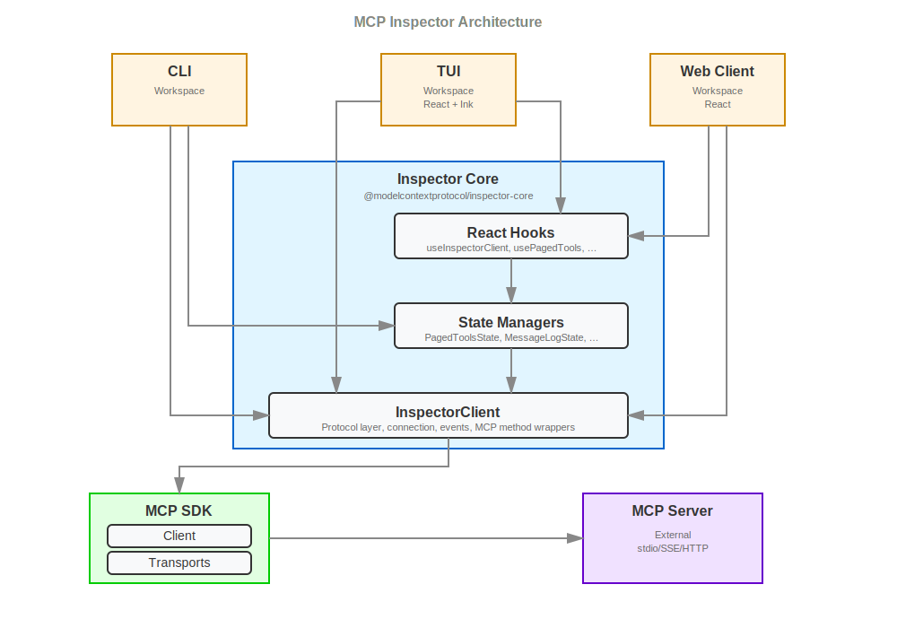

# MCP Inspector

The MCP inspector is a developer tool for testing and debugging [Model Context Protocol (MCP)](https://modelcontextprotocol.io/) servers. It is provided as a web app, a terminal user interface (TUI), and a command line interface (CLI), all supported by a shared core package that is also available to application developers for use in their own apps.

## Architecture Overview

The MCP Inspector provides multiple client interfaces built around a shared core protocol layer. For a deep dive into the underlying architecture, see our [Shared Code Architecture documentation](./docs/shared-code-architecture.md).



The repository consists of the following main packages:

- **[Web Client](./clients/web/README.md)**: A rich, interactive React-based browser UI for exploring, testing, and debugging MCP servers. Provides forms for tool execution, resource exploration, and prompt sampling.
- **[CLI Client](./clients/cli/README.md)**: A command-line interface for programmatic interaction with MCP servers. Ideal for scripting, automation, and creating feedback loops with AI coding assistants.
- **[TUI Client](./clients/tui/README.md)**: A terminal user interface that brings the interactive exploration capabilities of the web client directly to your terminal.
- **[Core](./core/README.md)**: The shared library providing `InspectorClient` and state managers, ensuring consistent protocol behavior across all interfaces.

## Quick Start (Web UI)

To get up and running right away with the UI, just execute the following:

```bash
npx @modelcontextprotocol/inspector
```

The server will start up and the UI will be accessible at `http://localhost:6274`.

> **Note**: For detailed usage instructions, configuration files (`mcp.json`), Docker deployment, and important security considerations, please see the [Web Client README](./clients/web/README.md).

## CLI Quick Start

To use the CLI, pass the command that starts your MCP server, then the method you want (e.g. list tools):

```bash
npx @modelcontextprotocol/inspector --cli <your-server-command> --method tools/list
```

Replace `<your-server-command>` with how you run your server (e.g. `node build/index.js` or `npx @modelcontextprotocol/server-everything`).

> **Note**: For full CLI capabilities, argument formatting, and scripting examples, please see the [CLI README](./clients/cli/README.md).

## TUI Quick Start

To launch the interactive terminal UI, pass the command that starts your MCP server:

```bash
npx @modelcontextprotocol/inspector --tui <your-server-command>
```

Replace `<your-server-command>` with how you run your server (e.g. `node build/index.js`).

> **Note**: For more information about terminal navigation and features, please see the [TUI README](./clients/tui/README.md).

## UI vs CLI

| Use Case                 | Web UI / Terminal UI                                                    | CLI                                                                                                |
| ------------------------ | ----------------------------------------------------------------------- | -------------------------------------------------------------------------------------------------- |
| **Server development**   | Visual interface for interactive testing and debugging                  | Scriptable commands for quick testing and CI; feedback loops with AI coding assistants like Cursor |
| **Resource exploration** | Interactive browser with hierarchical navigation and JSON visualization | Programmatic listing and reading for automation and scripting                                      |
| **Tool testing**         | Form-based parameter input with real-time response visualization        | Command-line tool execution with JSON output for scripting                                         |
| **Prompt engineering**   | Interactive sampling with streaming responses and visual comparison     | Batch processing of prompts with machine-readable output                                           |
| **Debugging**            | Request history, visualized errors, and real-time notifications         | Direct JSON output for log analysis and integration with other tools                               |
| **Automation**           | N/A                                                                     | Ideal for CI/CD pipelines, batch processing, and integration with coding assistants                |
| **Learning MCP**         | Rich visual interface helps new users understand server capabilities    | Simplified commands for focused learning of specific endpoints                                     |

## Usage Documentation

To specify which MCP server(s) to connect to (config file, `-e`, `--config`, `--server`, etc.), see [MCP server configuration](docs/mcp-server-configuration.md). For more on using the inspector, see the [Inspector section of the MCP docs site](https://modelcontextprotocol.io/docs/tools/inspector). For help with debugging, see the [Debugging guide](https://modelcontextprotocol.io/docs/tools/debugging).

## Contributing

If you're working on the inspector itself, see our [Development Guide](./AGENTS.md) and [Contributing Guidelines](./CONTRIBUTING.md).

## License

This project is licensed under the MIT License—see the [LICENSE](LICENSE) file for details.
