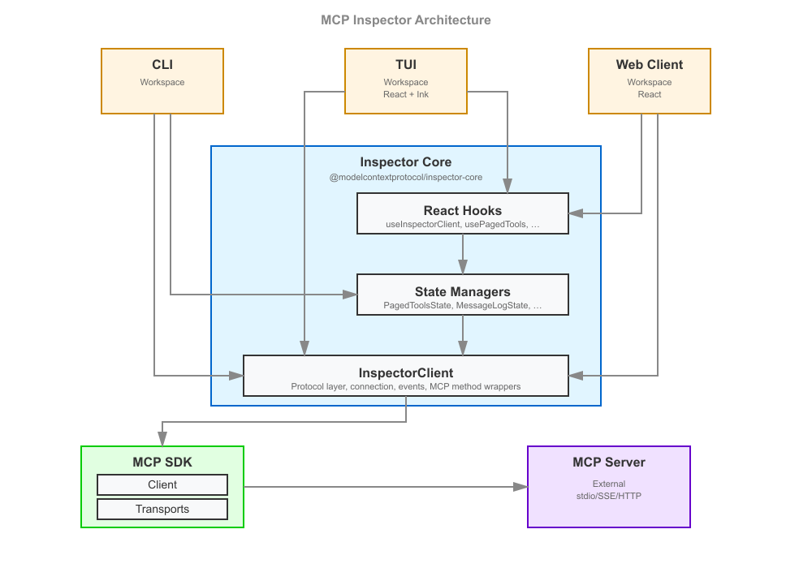

# MCP Inspector

A developer tool for inspecting [Model Context Protocol](https://modelcontextprotocol.io) (MCP) servers. It ships as a single package, `@modelcontextprotocol/inspector`, that provides three ways to inspect a server:

- **Web** — a Vite + React + [Mantine](https://mantine.dev) single-page app with a Node backend.
- **CLI** — a scriptable command-line client for automation, CI, and fast agent feedback loops.
- **TUI** — an interactive terminal UI built with [Ink](https://github.com/vadimdemedes/ink).

All three run through one global `mcp-inspector` binary:

```bash
npx @modelcontextprotocol/inspector          # web UI (default)
npx @modelcontextprotocol/inspector --cli    # CLI
npx @modelcontextprotocol/inspector --tui    # TUI
```

> **Repo status.** This is the **v2** line of the Inspector (branch `v2/main`). The `main` branch is the legacy v1 implementation (bug fixes only). v2 will eventually replace `main`. See [`AGENTS.md`](./AGENTS.md) for branch/board conventions.

## Project layout

v2 is **not** an npm workspace. Each client under `clients/*` keeps its own `package.json` and `node_modules`; shared code lives in `core/` and is consumed via a `@inspector/core` build-time alias (no `package.json` of its own). A single `npm install` at the root cascades installs into every client (see [Setup](#setup)).

```
inspector/
├── clients/
│   ├── web/          # Web client (Vite + React + Mantine). src/ = browser app; server/ = Node dev/prod backend
│   ├── cli/          # CLI client (tsup bundle, @inspector/core alias)
│   ├── tui/          # TUI client (Ink + React, tsup bundle)
│   └── launcher/     # Shared launcher — provides the `mcp-inspector` bin, dispatches to web/cli/tui
├── core/             # Shared code consumed via the `@inspector/core` alias (no package.json)
│   ├── auth/         # OAuth: providers, discovery, storage, mid-session recovery (browser/node/remote backends)
│   ├── json/         # JSON + parameter/argument conversion utilities
│   ├── logging/      # Silent pino logger singleton
│   ├── mcp/          # InspectorClient runtime, state stores, transports, config import
│   ├── react/        # React hooks over the state stores
│   └── storage/      # File I/O helpers for the OAuth persist backends
├── test-servers/     # Composable MCP test servers + fixtures used by integration tests
├── scripts/          # Root build/verify tooling (install cascade, smokes, pack:verify)
├── specification/    # Design/build specifications
├── AGENTS.md         # Contribution rules for agents AND humans (see below)
└── README.md         # You are here
```

Each client has its own README with client-specific detail:
[web](./clients/web/README.md) · [cli](./clients/cli/README.md) · [tui](./clients/tui/README.md) · [launcher](./clients/launcher/README.md).

Task-oriented guides live under [`docs/`](./docs) — see [Reviewing an MCP App](./docs/mcp-app-review.md), the CLI-first → one-shot-web recipe for automated App-tool review: `--app-info` probe → deep-link navigate → rendered widget, plus OAuth handoff and proxy support.

## Setup

Requires Node `>=22.19.0`.

```bash
npm install     # root install; postinstall cascades into every client
```

- **Fresh clone:** run `npm install` at the repo root.
- **After a pull that changes a client's dependencies:** re-run `npm install` at the root to re-sync every client.

The cascade (`scripts/install-clients.mjs`) is dev-only — it exits early when the package is installed as a dependency, and the published tarball ships only each client's `build/`, so end users are unaffected. Set `INSPECTOR_SKIP_CLIENT_INSTALL=1` to skip it.

## Running during development

For day-to-day web iteration, run Vite directly from the web client (fast HMR, no launcher build needed):

```bash
cd clients/web && npm run dev
```

The launcher-driven scripts below run the **built** launcher, so build first (`npm run build`):

```bash
npm run web        # prod web launcher against clients/web/dist
npm run web:dev    # web launcher in --dev mode (Vite)
```

## The `@inspector/core` shared package



`core/` holds the logic shared by all three clients so that web, CLI, and TUI behave identically. Its entry point is the **`InspectorClient`** class (`core/mcp/`), which owns the connection to an MCP server, the request/response lifecycle, and a set of state stores; `core/react/` exposes React hooks over those stores that both the web and TUI (Ink) React trees consume. OAuth (`core/auth/`) is factored into isomorphic logic plus browser/node/remote backends so the same flows work in the browser, in Node, and against a remote backend.

`core/` intentionally has **no `package.json`** — it is not published on its own. Each client bundles it in via a `@inspector/core` alias:

- **CLI / TUI:** `esbuildOptions.alias` in their `tsup.config.ts` maps `@inspector/core` → the repo `core/` directory, and `noExternal: [/^@inspector\/core/]` inlines it into the bundle.
- **Web:** the same alias in `clients/web/vite.config.ts` for the browser app and the Node backend runner.

Publishing `core/` as its own package (e.g. for third parties to build on) is deliberately deferred — see issue [#1636](https://github.com/modelcontextprotocol/inspector/issues/1636).

## Web client: "dumb components" + Storybook

The v2 web client is built from **presentational ("dumb") components** — they accept data and callbacks as props and contain only display logic, with no direct data fetching or client state. State comes from the `@inspector/core` hooks, wired in near the top of the tree. This keeps components isolated, testable, and documentable.

That approach is what makes **Storybook** first-class here: every screen and element component has a `*.stories.tsx` file (96+ stories) that renders it against fixture props. Storybook **play functions** double as interaction tests, run headless in CI (`npm run ci:storybook`, Chromium via Playwright).

Styling follows a strict Mantine-first convention (theme variants and component props over CSS classes, `--inspector-*` CSS custom properties over raw color literals). The full rules live in [`AGENTS.md`](./AGENTS.md) under **React instructions** — read them before touching web UI. Element components live in `clients/web/src/components/elements/`; theme variants in `clients/web/src/theme/`.

## Test servers

`test-servers/` provides **composable MCP servers** used by the integration and smoke suites, so tests exercise a real server over a real transport instead of mocks. A server is assembled from **presets** (fixture factories in `test-servers/src/preset-registry.ts` — tools, resources, prompts, tasks, elicitation, sampling, OAuth, …) and can be driven two ways:

- **In-process** — import the factories (`createTestServerHttp`, `createEchoTool`, …) and run the server inside the test's event loop (used by the HTTP integration paths).
- **As a subprocess** — `test-servers/build/test-server-stdio.js` is spawned as a real stdio child (used by the CLI smoke and stdio integration tests).

Configure a server declaratively with a JSON config (see `test-servers/configs/*.json`) selecting presets, then load it via `--config`. Because the servers are spawned as real subprocesses, the build output must exist first:

```bash
npm run test-servers:build   # (from clients/web) → tsc -p test-servers, emits test-servers/build/
```

The Vite alias `@modelcontextprotocol/inspector-test-server` (in `clients/web/vite.config.ts`) points at `test-servers/build/index.js` so `getTestMcpServerPath()` resolves to a real `.js` path.

A streamable-HTTP server can also serve the **modern (2026-07-28) protocol era** via the SDK's `createMcpHandler` — set `transport.modern` in the JSON config (`true` for dual-era stateless serving, or `{ "legacy": "reject" }` for modern-only strict), or pass `modern` on the `ServerConfig` for an in-process `createTestServerHttp`. This is what lets an Inspector connection negotiating `protocolEra: "auto" | "modern"` reach the modern leg (populated `server/discover`, sessionless). See `test-servers/configs/modern-http.json`. `test-servers/configs/modern-mrtr-http.json` additionally serves the `mrtr_confirm` tool (preset `mrtr_confirm`, `createMrtrTool`) over the modern leg: its handler returns `inputRequired(...)` embedding a form elicitation, so invoking it produces a real MRTR round-trip (`input_required` → the client fulfils the embedded elicitation and retries with a new id → `complete`). The Inspector drives MRTR manually (`inputRequired: { autoFulfill: false }`), so the embedded elicitation pauses at the pending-request modal (tagged "input_required") for you to answer, then the retry completes — useful for eyeballing both that pending-request UX and the Protocol view's MRTR conversation grouping. `test-servers/configs/mrtr-showcase-http.json` bundles every MRTR preset in one modern server for manual testing: `mrtr_confirm` (single round), `mrtr_two_step` (two elicitation rounds via `requestState`), `mrtr_sample` (embedded sampling → the Sampling panel), `mrtr_roots` (embedded `roots/list`, auto-answered silently from configured roots — no modal), `mrtr_edge` (an `inputRequests`-only round then a `requestState`-only round), and `mrtr_loop` (never completes → the `MRTR_MAX_ROUNDS` bound trips). (The legacy `collect_elicitation` preset calls `server.elicitInput`, which errors on the 2026-07-28 leg — server→client requests aren't allowed there; MRTR is the modern replacement.)

`test-servers/configs/modern-network-http.json` is the **Network-tab showcase** for the standardized HTTP headers and new error taxonomy (SEP-2243 / SEP-2575). It serves a `get_weather` tool whose `city` argument carries an `x-mcp-header: "City"` annotation (so a modern client mirrors it to `Mcp-Param-City`), plus four `trigger_*` tools that the modern leg's spec-error injector (`transport.modern.injectSpecErrors: true`) answers with a real HTTP status + JSON-RPC error body: `trigger_header_mismatch` → `400 / -32020`, `trigger_missing_capability` → `400 / -32021`, `trigger_unsupported_version` → `400 / -32022` (with `data.supported`), `trigger_method_not_found` → `404 / -32601`. Connect to it with **Protocol Era = Modern** and open the Network tab to see the mirrored `Mcp-*` headers highlighted, sentinel values decoded, and each error rendered distinctly. Note: `Mcp-Param-*` mirroring is **skipped by the SDK in the browser** (`detectProbeEnvironment() !== "browser"`), so calling `get_weather` from the **web** client omits `Mcp-Param-City` and the strict server answers `-32020` — the same tool is callable from the Node CLI/TUI, where mirroring is active.

`test-servers/configs/pagination-http.json` is the **page-by-page fetch showcase** (#1721). It serves 12 tools, 12 resources, and 12 prompts (presets `numbered_tools` / `numbered_resources` / `numbered_prompts`, `count: 12`) with `maxPageSize` of 4 for each, so every list paginates into three pages. Turn on **"Fetch Lists One Page at a Time"** (Server Settings — the `paginatedLists` setting, or the **Paginated** switch in a list sidebar) and the Tools/Resources/Prompts lists load page 1 only (4 items) with a **Load next page** control and an _N pages loaded_ status; each click fetches the next 4 and appends them, and Refresh resets to page 1. With the switch off (the default), the same lists auto-aggregate all three pages on connect.

`test-servers/configs/logging-legacy-http.json` and `test-servers/configs/logging-modern-http.json` are the **logging era-fork showcase** (#1629). Both serve `logging: true` plus a `send_notification` tool that emits a `notifications/message` at a chosen level; the legacy one is a plain streamable-HTTP server (`logging/setLevel` era) and the modern one sets `transport.modern: true`. Connect to the legacy server and open the **Logs** tab to get the session-scoped **Set Active Level** selector + **Set** button; calling `send_notification` streams the log into the panel. Connect to the modern one with **Protocol Era = Modern** and the same tab instead shows the **Log Level per Request** control — pick a level to opt in and the client stamps `_meta["io.modelcontextprotocol/logLevel"]` on every subsequent request (verify in the Network tab's request body); calling `send_notification` then streams the log into the panel over the request's SSE response. On the modern leg `send_notification` emits through the per-request `extra.sendNotification` (rebuilt from `ctx.mcpReq.notify`) so the SDK upgrades the response to SSE and the log rides the originating request's stream. **Caveat:** per spec a modern server emits `notifications/message` only for requests that opted in via the `logLevel` `_meta`, but this test server streams whenever a tool emits — the SDK beta strips the envelope from the handler-visible context, so the tool can't read the per-request level to gate on. The **client-side** opt-in (the `_meta` stamp) is the part #1629 owns and is fully observable in the Network tab.

## Building

```bash
npm run build     # builds all clients: web → cli → tui → launcher
```

Individual clients: `build:web`, `build:cli`, `build:tui`, `build:launcher`. The web build produces both the browser SPA (`clients/web/dist`, Vite) and the Node prod-server runner (`clients/web/build`, tsup).

## Testing & the quality gate

Each client self-validates from its own folder; the root scripts chain them. There is **no** aggregate root `test` script — use `validate` (fast) or `coverage` (the gate).

| Script                | What it does                                                                                                                                                        |
| --------------------- | ------------------------------------------------------------------------------------------------------------------------------------------------------------------- |
| `npm run validate`    | `format:check` + `lint` + `build` + fast unit tests, per client. The quick inner-loop check.                                                                        |
| `npm run coverage`    | The **per-file ≥90% gate** (lines/statements/functions/branches) under v8 instrumentation, per client. CI-enforced. For web this also runs the integration project. |
| `npm run smoke`       | End-to-end smokes through the built launcher (`--help` dispatch + prod cli/tui/web).                                                                                |
| `npm run ci`          | **Mandatory pre-push command.** `validate` → `coverage` → `smoke` → Storybook. A true superset of GitHub CI.                                                        |
| `npm run pack:verify` | Publish smoke — see [Publishing](#publishing).                                                                                                                      |

Per-client scripts exist too (`validate:web`, `coverage:cli`, `smoke:tui`, …). Run `npm run format` (per client) before committing — `validate` runs the non-fixing `format:check` and fails CI on any unformatted file.

For the full testing rules — the ≥90% per-file gate, where test files live, the unit vs. integration vs. storybook projects, and the `v8 ignore` policy — see [`AGENTS.md`](./AGENTS.md).

## Publishing

The root `@modelcontextprotocol/inspector` package ships as **one tarball with a single version number** — no separate `-web` / `-cli` / `-tui` / `-core` packages. `npm run build` builds every client, then `prepack` runs before `npm publish`. Runtime dependencies are declared on the root `package.json`; client builds bundle `@inspector/core` and externalize npm packages resolved from the root install.

### What ships, and the packaging invariants

The root `package.json` `"files"` allowlist is the source of truth for the tarball. A few non-obvious entries exist because they are read **at runtime** or were silently dropped by npm's packlist — do not remove them without re-running `npm run pack:verify`:

- **No source maps.** The client bundlers set `sourcemap: false` (`clients/{cli,tui}/tsup.config.ts`, `clients/web/tsup.runner.config.ts`); Vite and the launcher's `tsc` already emit none. Maps are ~half the unpacked size and aren't needed at runtime — debug via `npm run dev` on the source.
- **`clients/web/build` ships via `clients/web/.npmignore`.** `clients/web/.gitignore` lists `build/`, and npm's packlist honors that nested `.gitignore` over the root `"files"` allowlist — so the prod web-server runner was silently missing from the tarball while `clients/web/dist` slipped through (its `.gitignore` only lists `dist-ssr`). `clients/web/.npmignore` overrides the `.gitignore` for publishing so both `build/` (runner) and `dist/` (SPA) ship. The other clients don't need this — none ship a nested `.gitignore`.
- **A single version number, read from the root `package.json`.** The Inspector ships as one package with one version, so only the **root** `package.json` carries a `version` — the four `clients/*/package.json`s deliberately have none. Every Node client (CLI, TUI, and the web backend) resolves the version through the shared `readInspectorVersion()` reader in `core/node/version.ts`, which walks up to the root manifest (always present in the tarball). No client `package.json` is read at runtime, so none needs to ship. The web **browser** can't read the filesystem; it gets its version from the backend via `GET /api/config` (see [#1639](https://github.com/modelcontextprotocol/inspector/issues/1639)).

### `npm run pack:verify` — publish smoke against the real tarball

The `smoke:*` scripts run against the in-repo build tree, which is **not** the published package. `npm run pack:verify` (`scripts/pack-and-verify.mjs`) closes that gap: it builds, `npm pack`s the publishable tarball (asserting no source maps ship and that the runtime-required files are present), installs the tarball into a **clean throwaway consumer** — a fresh temp directory where it runs a real `npm install <tgz>` (pulls runtime deps, runs `postinstall`), exactly as `npx @modelcontextprotocol/inspector` would — and drives the installed `mcp-inspector` bin end to end: `--help` dispatch, a real `--cli tools/list` over stdio, and a prod `--web` boot that must serve `/` from the shipped `dist`. It catches "works in `--dev`, breaks under `npx …`" path/packaging failures. It requires network access (the install pulls deps), so it is a local / release check, **not** part of the fast `validate`/`ci` loop.

### Cutting a release

Publishing is automated by two release-gated jobs in [`.github/workflows/main.yml`](.github/workflows/main.yml) (`github.event_name == 'release'`, both `needs: build`):

- **`publish`** — the npm package. Runs `npm run pack:verify` as the pre-publish gate, asserts the release tag matches the root `package.json` version, then `npm publish --access public --provenance` — a single `npm publish` (v2 is not an npm workspace, so there is no v1-style `publish-all`/`--workspaces`), with a signed provenance attestation via GitHub OIDC (`id-token: write`, `environment: release`, `NPM_TOKEN`).
- **`publish-github-container-registry`** — the container image (see [Docker](#docker)).

Because there is **one version number** (only the root `package.json` has one — the clients carry none, so there is nothing to keep in sync and no `check-version` step), the release flow is just:

```bash
npm version <major|minor|patch>   # bumps the root package.json + tags
git push --follow-tags
# then draft & publish a GitHub Release for that tag → triggers `publish`
```

The release's target commit selects which workflow runs, so this only publishes when a release is cut from a commit carrying this (v2) workflow.

### Docker

A container image is published to GHCR (`ghcr.io/modelcontextprotocol/inspector`, `linux/amd64` + `linux/arm64`) by the release workflow. The [`Dockerfile`](Dockerfile) is a two-stage build: the first stage installs and `npm pack`s the publishable tarball; the second stage `npm install -g`s that tarball, so the image ships the exact same artifact as npm, with a clean `mcp-inspector` bin.

```bash
# run the web UI (reads the auth token from the container logs)
docker run --rm -p 6274:6274 ghcr.io/modelcontextprotocol/inspector

# or build the image locally
docker build -t mcp-inspector .
docker run --rm -p 6274:6274 mcp-inspector
```

The image defaults to `--web` bound to `0.0.0.0:6274` with browser auto-open disabled; override the args to run another mode (`docker run --rm ghcr.io/modelcontextprotocol/inspector --cli …`). Pass `-e MCP_INSPECTOR_API_TOKEN=…` to set a known token (otherwise one is generated and printed in the logs), or `-e DANGEROUSLY_OMIT_AUTH=true` to disable auth. The image runs as the non-root `node` user and has a `HEALTHCHECK` that probes the web UI — it assumes the default `--web` mode, so add `--no-healthcheck` when running `--cli`/`--tui` (which have no web server).

## Contributing — `AGENTS.md` and `CLAUDE.md`

**[`AGENTS.md`](./AGENTS.md) is the contract for changing this codebase, and it applies to humans and AI agents alike.** It is not agent-only boilerplate — it holds the project's real conventions: the issue-and-board workflow, branch/label rules, the TypeScript and Mantine/React standards, the testing and coverage requirements, and the mandatory pre-push gate. Read it before making changes, and keep it up to date when you change structure, tooling, or rules.

`CLAUDE.md` is the entry point the [Claude Code](https://claude.com/claude-code) agent loads automatically; it simply includes `AGENTS.md` and this README, so both agents and humans work from the same source of truth. If you use a different agent that reads `AGENTS.md`, you get the same rules.

A key rule worth surfacing here: **all work is issue-driven.** Before starting, find or create a tracking issue on the v2 project board; open PRs against `v2/main` with `Closes #<issue>`. The exact recipes (labels, board IDs, statuses) are in `AGENTS.md`.

## License

MIT.
