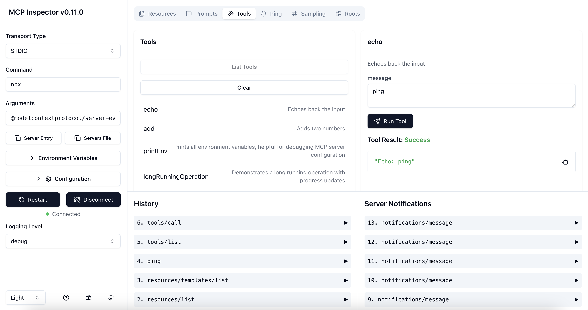

# MCP Debug Inspector (Fork)

This is a fork of the MCP Inspector with experimental support for the latest features:

- **Streamable HTTP Protocol Support**: Full implementation of the Streamable HTTP transport protocol as specified in the MCP 2025-03-26 revision
- **Direct Connection Mode**: Connect directly to MCP servers without proxy intermediation for lower latency and real-world client simulation
- **Enhanced Debugging**: Improved error handling and diagnostic information for HTTP transport development

## How to Use the New Features

### Streamable HTTP

The inspector now fully supports the Streamable HTTP protocol. To use it:

1. Select "Streamable HTTP" from the transport type dropdown
2. Enter the URL of your MCP server (ensure the path ends with `/mcp`)
3. Click "Connect"

### Direct Connection Mode

For SSE and Streamable HTTP transports, you can now bypass the inspector's proxy server and connect directly to the MCP server:

1. Select either "SSE" or "Streamable HTTP" from the transport type dropdown
2. Check the "Direct connection (no proxy)" checkbox
3. Enter the URL of your MCP server
4. Click "Connect"

Direct connection mode provides:
- Lower latency - no proxy intermediation
- More realistic client behavior - connecting directly as a browser client would
- Better testing of actual CORS configurations

Note that some debugging capabilities (like request/response inspection at the proxy level) are not available in direct mode.

# MCP Inspector

The MCP inspector is a developer tool for testing and debugging MCP servers.



## Running the Inspector

### From an MCP server repository

To inspect an MCP server implementation, there's no need to clone this repo. Instead, use `npx`. For example, if your server is built at `build/index.js`:

```bash
npx @modelcontextprotocol/inspector node build/index.js
```

You can pass both arguments and environment variables to your MCP server. Arguments are passed directly to your server, while environment variables can be set using the `-e` flag:

```bash
# Pass arguments only
npx @modelcontextprotocol/inspector build/index.js arg1 arg2

# Pass environment variables only
npx @modelcontextprotocol/inspector -e KEY=value -e KEY2=$VALUE2 node build/index.js

# Pass both environment variables and arguments
npx @modelcontextprotocol/inspector -e KEY=value -e KEY2=$VALUE2 node build/index.js arg1 arg2

# Use -- to separate inspector flags from server arguments
npx @modelcontextprotocol/inspector -e KEY=$VALUE -- node build/index.js -e server-flag
```

The inspector runs both a client UI (default port 5173) and an MCP proxy server (default port 3000). Open the client UI in your browser to use the inspector. You can customize the ports if needed:

```bash
CLIENT_PORT=8080 SERVER_PORT=9000 npx @modelcontextprotocol/inspector node build/index.js
```

For more details on ways to use the inspector, see the [Inspector section of the MCP docs site](https://modelcontextprotocol.io/docs/tools/inspector). For help with debugging, see the [Debugging guide](https://modelcontextprotocol.io/docs/tools/debugging).

## Architecture

The MCP Inspector consists of three main components that communicate with each other:

1. **Browser UI**: The web interface that shows requests, responses, and other debugging information.
2. **Inspector Server**: A backend proxy server that bridges between the browser UI and the actual MCP server.
3. **MCP Server**: The target server being debugged, which implements the MCP protocol.

The communication flow works like this:

```
Browser UI <-> Inspector Server <-> MCP Server
   (SSE)          (Transport)
```

- The Browser UI always communicates with the Inspector Server using SSE (Server-Sent Events).
- The Inspector Server communicates with the MCP Server using one of three transport options:
  - **STDIO**: Spawns the MCP Server as a subprocess and communicates via standard I/O.
  - **SSE**: Connects to a remote MCP Server using Server-Sent Events protocol.
  - **Streamable HTTP**: Connects to a remote MCP Server using the Streamable HTTP protocol.

When you choose a transport type in the UI, it affects only how the Inspector Server communicates with the MCP Server, not how the Browser UI and Inspector Server communicate.

## Supported Transport Types

The inspector supports three transport methods to communicate with MCP servers:

1. **Stdio**: Launches the MCP server as a subprocess and communicates via standard input/output. This is the most common transport for local development.

2. **SSE (Server-Sent Events)**: Connects to a remote MCP server via SSE. This is useful for debugging cloud-hosted MCP servers.

3. **Streamable HTTP**: Connects to an MCP server that implements the Streamable HTTP transport protocol as specified in MCP Protocol Revision 2025-03-26. This transport provides a more standardized HTTP-based communication method.

You can select the transport type in the inspector's UI.

### Authentication

The inspector supports bearer token authentication for SSE and Streamable HTTP connections. Enter your token in the UI when connecting to an MCP server, and it will be sent in the Authorization header.

### Security Considerations

The MCP Inspector includes a proxy server that can run and communicate with local MCP processes. The proxy server should not be exposed to untrusted networks as it has permissions to spawn local processes and can connect to any specified MCP server.

### From this repository

If you're working on the inspector itself:

Development mode:

```bash
npm run dev
```

> **Note for Windows users:**  
> On Windows, use the following command instead:
>
> ```bash
> npm run dev:windows
> ```

Production mode:

```bash
npm run build
npm start
```

## License

This project is licensed under the MIT License—see the [LICENSE](LICENSE) file for details.
