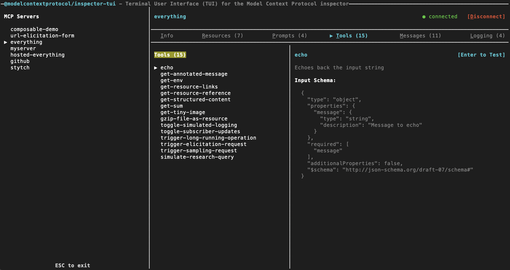

# MCP Inspector TUI Client

The Terminal User Interface (TUI) client brings the interactive exploration capabilities of the Web Client directly to your terminal. It is built using [Ink](https://github.com/vadimdemedes/ink) to provide a rich, React-like component experience in a command-line environment.



## Running the TUI

You can run the TUI client via `npx`:

```bash
npx @modelcontextprotocol/inspector --tui node build/index.js
```

### With Configuration Files

The TUI can load all servers from an MCP catalog/config file. With no source
flag it uses the default writable catalog `~/.mcp-inspector/mcp.json` (seeded
empty if missing):

```bash
npx @modelcontextprotocol/inspector --tui --catalog mcp.json   # writable catalog (seeded if missing)
npx @modelcontextprotocol/inspector --tui --config mcp.json    # read-only session (errors if absent)
```

(It does not use `--server`; all servers in the file are available in the TUI.)

## Options

### MCP server (which server(s) to connect to)

Options that specify the MCP server(s) (catalog/config file, ad-hoc command/URL, env vars, headers) are shared by the Web, CLI, and TUI and are documented in [MCP server configuration](../../docs/mcp-server-configuration.md): `--catalog` (writable catalog, seeded if missing; default `~/.mcp-inspector/mcp.json` or `MCP_CATALOG_PATH`), `--config` (read-only session, errors if absent), `-e`, `--cwd`, `--header`, `--transport`, `--server-url`, and the positional `[target...]`. `--catalog` and `--config` are mutually exclusive, and neither combines with an ad-hoc target.

### TUI-specific (OAuth for HTTP servers)

The TUI supports OAuth for **SSE** and **Streamable HTTP** servers. Per-server OAuth fields in `mcp.json` (static client id/secret, scopes, enterprise-managed flag) are applied automatically when loaded from `--catalog` or `--config`. Install-wide settings (CIMD, enterprise IdP) come from **`~/.mcp-inspector/storage/client.json`** — the same file the web **Client Settings** dialog writes. You can point at a different file with `--client-config` or `MCP_CLIENT_CONFIG_PATH`.

#### OAuth callback URL

The TUI starts a small loopback HTTP server to receive the authorization redirect after you sign in in the browser. Defaults:

| Surface | Default callback |
| ------- | ---------------- |
| **Web** | `http://localhost:6274/oauth/callback` (main app server) |
| **TUI** | `http://127.0.0.1:6276/oauth/callback` (dedicated runner port; avoids colliding with web on 6274) |

OAuth redirect URIs must match **exactly** what you register on the authorization server — `localhost` and `127.0.0.1` are different URIs. Register the TUI default on your OAuth app / IdP when using pre-registered (static) or enterprise-managed clients.

Override the TUI listener with `--callback-url` or `MCP_OAUTH_CALLBACK_URL`. Use `http://127.0.0.1:0/oauth/callback` for an OS-assigned ephemeral port when the authorization server registers redirect URIs dynamically (DCR).

#### Flags

| Option | Env | Description |
| ------ | --- | ----------- |
| `--client-config <path>` | `MCP_CLIENT_CONFIG_PATH` | Install-level client config (default: `~/.mcp-inspector/storage/client.json`). |
| `--client-id <id>` | — | OAuth client ID (static client); overrides `client.json`. |
| `--client-secret <secret>` | — | OAuth client secret (confidential clients); overrides `client.json`. |
| `--client-metadata-url <url>` | — | Client ID Metadata Document URL (CIMD); overrides `client.json`. |
| `--callback-url <url>` | `MCP_OAUTH_CALLBACK_URL` | OAuth redirect/callback listener (default: `http://127.0.0.1:6276/oauth/callback`). |

#### Authenticating in the TUI

1. Select an HTTP/SSE server and press **C** to connect.
2. If authorization is required, the TUI starts OAuth automatically (browser opens for sign-in).
3. After the callback completes, connect finishes without a second **C**.
4. Use the **Auth** tab to inspect OAuth state (same fields as web Connection Info) or **Clear OAuth state** (disconnects when connected).

See also [EMA / enterprise-managed auth](../../specification/v2_auth_ema.md) and [OAuth smoke testing](../../specification/v2_auth_smoke_testing.md) for staging servers and verification steps.

## Features

The TUI provides terminal-native tabs and panes for interacting with your MCP server:

- **Resources**: Browse and read resources exposed by the server.
- **Prompts**: List and test prompts.
- **Tools**: View available tools and execute them with form-like inputs.
- **History**: View the request and response history of your interactions.
- **Console**: View the direct stdout/stderr and diagnostic logging of the connected server.

## Navigation

- Use the **Arrow Keys** (Left/Right) or **Tab** to switch between the main tabs (Resources, Tools, Prompts, etc.).
- Use the **Arrow Keys** (Up/Down) to scroll through lists of items.
- Press **Enter** to select an item, execute a tool, or fetch a resource.
- Press **Escape** or `Ctrl+C` to exit the application.

## Development

Like the other clients, the TUI self-validates from its own folder:

```bash
npm run validate       # format:check && lint && build && test:coverage
npm test               # run all tests
npm run test:coverage  # run tests under the per-file coverage gate
```

The repo-root `validate:tui` just delegates here. `eslint.config.js` registers
`react-hooks` for the classic rules only (rules-of-hooks + exhaustive-deps); the
stricter react-hooks@7 rules are not enforced on the interim component surface
(#1501).

Tests live in `__tests__/`. The coverage gate currently covers the TUI's
non-React logic (server resolution, logger, tab metadata, and the `utils/`
form/URL helpers); the Ink components and `App.tsx` are an interim exclusion in
`vitest.config.ts` pending a renderer-based follow-up.
