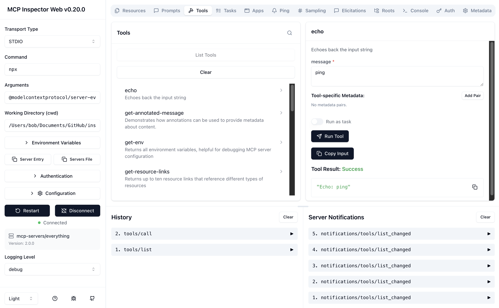

# MCP Inspector Web Client

The Web Client is a React-based application that provides a rich, interactive browser UI for exploring, testing, and debugging MCP servers. It is the primary interface for most users.



## Running the Web Inspector

### Quick Start

To start the Web UI from npm:

```bash
npx @modelcontextprotocol/inspector
```

The server will start up and the UI will be accessible at `http://localhost:6274`.

### From an MCP server repository

To inspect a local MCP server implementation, run the inspector and pass your server's run command:

```bash
# E.g., for a Node.js server built at build/index.js
npx @modelcontextprotocol/inspector node build/index.js
```

You can pass both arguments and environment variables to your MCP server. Arguments are passed directly, while environment variables can be set using the `-e` flag:

```bash
# Pass arguments only
npx @modelcontextprotocol/inspector node build/index.js arg1 arg2

# Pass environment variables only
npx @modelcontextprotocol/inspector -e key=value -e key2=$VALUE2 node build/index.js

# Use -- to separate inspector flags from server arguments
npx @modelcontextprotocol/inspector -e key=$VALUE -- node build/index.js -e server-flag
```

The inspector runs the **main web server** (UI and API; default port 6274) and a **sandbox server** for MCP Apps (default: automatic port; you can fix it with `MCP_SANDBOX_PORT`). Customize ports via environment variables:

```bash
CLIENT_PORT=8080 MCP_SANDBOX_PORT=9000 npx @modelcontextprotocol/inspector node build/index.js
```

### Docker Container

You can start the web inspector in a Docker container with the following command:

```bash
docker run --rm \
  -p 127.0.0.1:6274:6274 \
  -p 127.0.0.1:6277:6277 \
  -e HOST=0.0.0.0 \
  -e MCP_AUTO_OPEN_ENABLED=false \
  ghcr.io/modelcontextprotocol/inspector:latest
```

## Configuring the web app

These settings control the **web server and UI** (host, port, auth, sandbox, etc.). They are separate from [MCP server configuration](../../docs/mcp-server-configuration.md) (which server to connect to).

All of these are set via **environment variables**; the web app has no command-line flags for port, host, auth, or sandbox. Where a setting had both env and CLI, the CLI would override—today the only web-specific CLI option is `--dev` (development mode). Set env vars in your shell or in the same line as the command (e.g. `CLIENT_PORT=8080 npx @modelcontextprotocol/inspector`).

| Setting                            | How to set                                                                                                                         | Default            |
| ---------------------------------- | ---------------------------------------------------------------------------------------------------------------------------------- | ------------------ |
| **Main server port**               | Env: `CLIENT_PORT`                                                                                                                 | `6274`             |
| **Host** (bind address)            | Env: `HOST`                                                                                                                        | `localhost`        |
| **Auth token**                     | Env: `MCP_INSPECTOR_API_TOKEN`; if unset, `MCP_PROXY_AUTH_TOKEN` (legacy). If both unset, a random token is generated and printed. | (random if unset)  |
| **Disable auth**                   | Env: `DANGEROUSLY_OMIT_AUTH` (any non-empty value). **Dangerous;** see Security below.                                             | (unset)            |
| **Sandbox port** (MCP Apps)        | Env: `MCP_SANDBOX_PORT`; if unset, `SERVER_PORT` (legacy). Use `0` or leave unset for an automatic port.                           | automatic          |
| **Storage directory** (e.g. OAuth) | Env: `MCP_STORAGE_DIR`                                                                                                             | (unset)            |
| **Allowed origins** (CORS)         | Env: `ALLOWED_ORIGINS` (comma-separated)                                                                                           | client origin only |
| **Log file**                       | Env: `MCP_LOG_FILE` — if set, server logs are appended to this file.                                                               | (unset)            |
| **Open browser on start**          | Env: `MCP_AUTO_OPEN_ENABLED` — set to `false` to disable.                                                                          | `true`             |
| **Development mode**               | CLI only: `--dev` (Vite with HMR). No env var.                                                                                     | off                |

Options that specify **which MCP server** to connect to (`--config`, `--server`, `-e`, `--cwd`, `--header`, `--transport`, `--server-url`, and positional command/URL) are shared by Web, CLI, and TUI and are documented in [MCP server configuration](../../docs/mcp-server-configuration.md).

## Security Considerations

The MCP Inspector proxy server runs and communicates with local MCP processes. It should **not** be exposed to untrusted networks, as it can spawn local processes and connect to any specified MCP server.

### Authentication

The proxy server requires authentication by default. When starting the server, a random session token is generated:

```
🔑 Session token: <token>
🔗 Open inspector with token pre-filled: http://localhost:6274/?MCP_INSPECTOR_API_TOKEN=<token>
```

This token must be included as a Bearer token in the Authorization header. By default, the inspector automatically opens your browser with the token pre-filled in the URL.

If you already have the UI open, click the **Configuration** button in the sidebar, find "Proxy Session Token", and enter the displayed token.

> **🚨 WARNING:** Disabling authentication with `DANGEROUSLY_OMIT_AUTH=true` is incredibly dangerous. It leaves your machine open to attacks even via your web browser (e.g., visiting a malicious website). Do not disable this feature unless you truly understand the risks.

### Local-only Binding

By default, the web client and proxy server bind only to `localhost`. If you need to bind to all interfaces for development, you can override this with the `HOST` environment variable (`HOST=0.0.0.0`), but only do so in trusted networks.

### DNS Rebinding Protection

To prevent DNS rebinding attacks, the Inspector validates the `Origin` header on incoming requests. By default, only requests from the client origin are allowed. You can configure additional allowed origins using the `ALLOWED_ORIGINS` environment variable (comma-separated).

## Configuration

### Settings (browser UI)

Click the **Configuration** button in the UI to adjust these. They are stored in the browser and can be overridden via URL query params (see below).

| Setting                                 | Description                                                                                      | Default                |
| --------------------------------------- | ------------------------------------------------------------------------------------------------ | ---------------------- |
| `MCP_SERVER_REQUEST_TIMEOUT`            | Client-side timeout (ms) – Inspector cancels the request if no response is received.             | 300000                 |
| `MCP_REQUEST_TIMEOUT_RESET_ON_PROGRESS` | Reset timeout on progress notifications.                                                         | true                   |
| `MCP_REQUEST_MAX_TOTAL_TIMEOUT`         | Maximum total timeout for requests sent to the MCP server (ms).                                  | 60000                  |
| API Token (Proxy Session Token)         | Auth token for the Inspector API; also set via `MCP_INSPECTOR_API_TOKEN` env var or query param. | (from server or query) |
| `MCP_TASK_TTL`                          | Default TTL (ms) for newly created tasks.                                                        | 60000                  |

_Note on timeouts:_ These control when the Inspector cancels requests; they are independent of the MCP server’s own timeouts.

### MCP server (config file and CLI options)

To use a config file (`--config`, `--server`) or ad-hoc options (`-e`, `--cwd`, `--header`, positional command/URL), see [MCP server configuration](../../docs/mcp-server-configuration.md).

### Servers File Export

The UI provides convenient buttons to export server launch configurations (usually for an `mcp.json` file used by tools like Cursor or Claude Code):

- **Server Entry**: Copies a single server configuration entry to your clipboard.
- **Servers File**: Copies a complete MCP configuration file structure with your server as `default-server`.

## URL Query Parameters

You can set the initial configuration via query parameters in the browser URL:

- Server settings: `?transport=sse&serverUrl=http://localhost:8787/sse` or `?transport=stdio&serverCommand=node&serverArgs=index.js`
- Inspector settings: `?MCP_SERVER_REQUEST_TIMEOUT=60000`

If both the query param and localStorage are set, the query param takes precedence.
