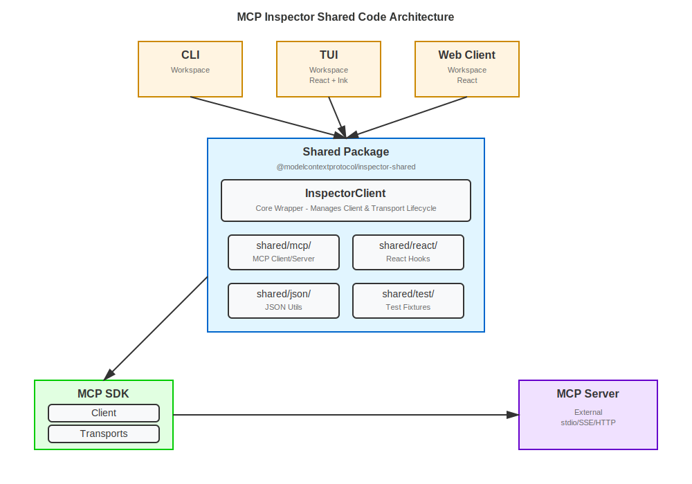
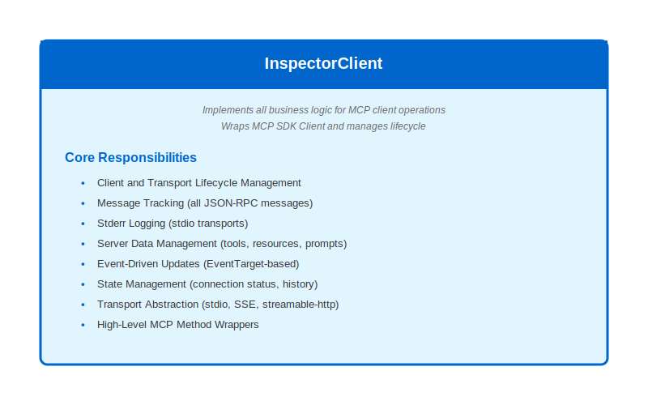

# Shared Code Architecture for MCP Inspector

## Overview

This document describes a shared code architecture that enables code reuse across the MCP Inspector's three user interfaces: the **CLI**, **TUI** (Terminal User Interface), and **web client** (likely targeting v2). The shared codebase approach prevents the feature drift and maintenance burden that can occur when each app has a separate implementation.

### Motivation

Previously, the CLI and web client had no shared code, leading to:

- **Feature drift**: Implementations diverged over time
- **Maintenance burden**: Bug fixes and features had to be implemented twice
- **Inconsistency**: Different behavior across interfaces
- **Duplication**: Similar logic implemented separately in each interface

Adding the TUI (as-is) with yet another separate implementation seemed problematic given the above.

The shared code architecture addresses these issues by providing a single source of truth for MCP client operations that all three interfaces can use.

## Current Architecture

### Architecture Diagram



### Project Structure

```
inspector/
├── cli/              # CLI workspace (uses shared code)
├── tui/              # TUI workspace (uses shared code)
├── client/           # Web client workspace (to be migrated)
├── server/           # Proxy server workspace
├── shared/           # Shared code workspace package
│   ├── mcp/          # MCP client/server interaction
│   ├── react/        # Shared React code
│   ├── json/         # JSON utilities
│   └── test/         # Test fixtures and harness servers
└── package.json      # Root workspace config
```

### Shared Package (`@modelcontextprotocol/inspector-shared`)

The `shared/` directory is a **workspace package** that:

- **Private** (`"private": true`) - internal-only, not published
- **Built separately** - compiles to `shared/build/` with TypeScript declarations
- **Referenced via package name** - workspaces import using `@modelcontextprotocol/inspector-shared/*`
- **Uses TypeScript Project References** - CLI and TUI reference shared for build ordering and type resolution
- **React peer dependency** - declares React 19.2.3 as peer dependency (consumers provide React)

**Build Order**: Shared must be built before CLI and TUI (enforced via TypeScript Project References and CI workflows).

## InspectorClient: The Core Shared Component

### Overview

`InspectorClient` (`shared/mcp/inspectorClient.ts`) is a comprehensive wrapper around the MCP SDK `Client` that manages the creation and lifecycle of the MCP client and transport. It provides:

- **Unified Client Interface**: Single class handles all client operations
- **Client and Transport Lifecycle**: Manages creation, connection, and cleanup of MCP SDK `Client` and `Transport` instances
- **Message Tracking**: Automatically tracks all JSON-RPC messages (requests, responses, notifications)
- **Stderr Logging**: Captures and stores stderr output from stdio transports
- **Event-Driven Updates**: Uses `EventTarget` for reactive UI updates (cross-platform: works in browser and Node.js)
- **Server Data Management**: Automatically fetches and caches tools, resources, prompts, capabilities, server info, and instructions
- **State Management**: Manages connection status, message history, and server state
- **Transport Abstraction**: Works with all `Transport` types (stdio, SSE, streamable-http)
- **High-Level Methods**: Provides convenient wrappers for tools, resources, prompts, and logging



### Key Features

**Connection Management:**

- `connect()` - Establishes connection and optionally fetches server data
- `disconnect()` - Closes connection and clears server state
- Connection status tracking (`disconnected`, `connecting`, `connected`, `error`)

**Message Tracking:**

- Tracks all JSON-RPC messages with timestamps, direction, and duration
- `MessageEntry[]` format with full request/response/notification history
- Event-driven updates (`message`, `messagesChange` events)

**Server Data Management:**

- Auto-fetches tools, resources, prompts (configurable via `autoFetchServerContents`)
- Caches capabilities, serverInfo, instructions
- Event-driven updates for all server data (`toolsChange`, `resourcesChange`, `promptsChange`, etc.)

**MCP Method Wrappers:**

- `listTools(metadata?)` - List available tools
- `callTool(name, args, generalMetadata?, toolSpecificMetadata?)` - Call a tool with automatic parameter conversion
- `listResources(metadata?)` - List available resources
- `readResource(uri, metadata?)` - Read a resource by URI
- `listResourceTemplates(metadata?)` - List resource templates
- `listPrompts(metadata?)` - List available prompts
- `getPrompt(name, args?, metadata?)` - Get a prompt with automatic argument stringification
- `setLoggingLevel(level)` - Set logging level with capability checks

**Configurable Options:**

- `autoFetchServerContents` - Controls whether to auto-fetch tools/resources/prompts on connect (default: `true` for TUI, `false` for CLI)
- `initialLoggingLevel` - Sets the logging level on connect if server supports logging (optional)
- `maxMessages` - Maximum number of messages to store (default: 1000)
- `maxStderrLogEvents` - Maximum number of stderr log entries to store (default: 1000)
- `pipeStderr` - Whether to pipe stderr for stdio transports (default: `true` for TUI, `false` for CLI)

### Event System

`InspectorClient` extends `EventTarget` for cross-platform compatibility:

**Events with payloads:**

- `statusChange` → `ConnectionStatus`
- `toolsChange` → `Tool[]`
- `resourcesChange` → `ResourceReference[]`
- `promptsChange` → `PromptReference[]`
- `capabilitiesChange` → `ServerCapabilities | undefined`
- `serverInfoChange` → `Implementation | undefined`
- `instructionsChange` → `string | undefined`
- `message` → `MessageEntry`
- `stderrLog` → `StderrLogEntry`
- `error` → `Error`

**Events without payloads (signals):**

- `connect` - Connection established
- `disconnect` - Connection closed
- `messagesChange` - Message list changed (fetch via `getMessages()`)
- `stderrLogsChange` - Stderr logs changed (fetch via `getStderrLogs()`)

### Shared Module Structure

**`shared/mcp/`** - MCP client/server interaction:

- `inspectorClient.ts` - Main `InspectorClient` class
- `transport.ts` - Transport creation from `MCPServerConfig`
- `config.ts` - Config file loading (`loadMcpServersConfig`)
- `types.ts` - Shared types (`MCPServerConfig`, `MessageEntry`, `ConnectionStatus`, etc.)
- `messageTrackingTransport.ts` - Transport wrapper for message tracking
- `index.ts` - Public API exports

**`shared/json/`** - JSON utilities:

- `jsonUtils.ts` - JSON value types and conversion utilities (`JsonValue`, `convertParameterValue`, `convertToolParameters`, `convertPromptArguments`)

**`shared/react/`** - Shared React code:

- `useInspectorClient.ts` - React hook that subscribes to EventTarget events and provides reactive state (works in both TUI and web client)

**`shared/test/`** - Test fixtures and harness servers:

- `test-server-fixtures.ts` - Shared server configs and definitions
- `test-server-http.ts` - HTTP/SSE test server
- `test-server-stdio.ts` - Stdio test server

## Integration History

### Phase 1: TUI Integration (Complete)

The TUI was integrated from the [`mcp-inspect`](https://github.com/TeamSparkAI/mcp-inspect) project as a standalone workspace. During integration, the TUI developed `InspectorClient` as a comprehensive client wrapper, providing a good foundation for code sharing.

**Key decisions:**

- TUI developed `InspectorClient` to wrap MCP SDK `Client`
- Organized MCP code into `tui/src/mcp/` module
- Created React hook `useInspectorClient` for reactive state management

### Phase 2: Extract to Shared Package (Complete)

All MCP-related code was moved from TUI to `shared/` to enable reuse:

**Moved to `shared/mcp/`:**

- `inspectorClient.ts` - Main client wrapper
- `transport.ts` - Transport creation
- `config.ts` - Config loading
- `types.ts` - Shared types
- `messageTrackingTransport.ts` - Message tracking wrapper

**Moved to `shared/react/`:**

- `useInspectorClient.ts` - React hook

**Moved to `shared/test/`:**

- Test fixtures and harness servers (from CLI tests)

**Configuration:**

- Created `shared/package.json` as workspace package
- Configured TypeScript Project References
- Set React 19.2.3 as peer dependency
- Aligned all workspaces to React 19.2.3

### Phase 3: CLI Migration (Complete)

The CLI was migrated to use `InspectorClient` from the shared package:

**Changes:**

- Replaced direct SDK `Client` usage with `InspectorClient`
- Moved CLI helper functions (`tools.ts`, `resources.ts`, `prompts.ts`) into `InspectorClient` as methods
- Extracted JSON utilities to `shared/json/jsonUtils.ts`
- Deleted `cli/src/client/` directory
- Implemented local `argsToMcpServerConfig()` function in CLI to convert CLI arguments to `MCPServerConfig`
- CLI now uses `inspectorClient.listTools()`, `inspectorClient.callTool()`, etc. directly

**Configuration:**

- CLI sets `autoFetchServerContents: false` (calls methods directly)
- CLI sets `initialLoggingLevel: "debug"` for consistent logging

## Current Usage

### CLI Usage

The CLI uses `InspectorClient` for all MCP operations:

```typescript
// Convert CLI args to MCPServerConfig
const config = argsToMcpServerConfig(args);

// Create InspectorClient
const inspectorClient = new InspectorClient(config, {
  clientIdentity,
  autoFetchServerContents: false, // CLI calls methods directly
  initialLoggingLevel: "debug",
});

// Connect and use
await inspectorClient.connect();
const result = await inspectorClient.listTools(args.metadata);
await inspectorClient.disconnect();
```

### TUI Usage

The TUI uses `InspectorClient` via the `useInspectorClient` React hook:

```typescript
// In TUI component
const { status, messages, tools, resources, prompts, connect, disconnect } =
  useInspectorClient(inspectorClient);

// InspectorClient is created from config and managed by App.tsx
// The hook automatically subscribes to events and provides reactive state
```

**TUI Configuration:**

- Sets `autoFetchServerContents: true` (default) - automatically fetches server data on connect
- Uses `useInspectorClient` hook for reactive UI updates
- `ToolTestModal` uses `inspectorClient.callTool()` directly

**TUI Status:**

- **Experimental**: The TUI functionality may be considered "experimental" until sufficient testing and review of features and implementation. This allows for iteration and refinement based on user feedback before committing to a stable feature set.
- **Feature parity**: The TUI now supports OAuth (static client, CIMD, DCR, guided auth), completions, elicitation, sampling, and HTTP request tracking. InspectorClient provides all of these.

**Entry Point:**
The TUI is invoked via the main `mcp-inspector` command with a `--tui` flag:

- `mcp-inspector --tui ...` → TUI mode
- `mcp-inspector --cli ...` → CLI mode
- `mcp-inspector ...` → Web client mode (default)

This provides a single entry point with consistent argument parsing across all three UX modes.

## Phase 4: TUI Feature Gaps (Complete)

InspectorClient supports OAuth (static client, CIMD, DCR, guided auth), completions (`getCompletions`), elicitation (pending elicitations, `newPendingElicitation` event), sampling (pending samples, `newPendingSample` event), roots (`getRoots`, `setRoots`), progress notifications, and custom headers via `MCPServerConfig`. The TUI uses these features.

## InspectorClient Readiness for Web App

### Current State

InspectorClient is **close to ready** for web app support. The core functionality matches what the web client needs:

| Capability                | InspectorClient                                    | Web Client useConnection                     |
| ------------------------- | -------------------------------------------------- | -------------------------------------------- |
| Connection management     | ✅ `connect()`, `disconnect()`, status events      | ✅                                           |
| Tools, resources, prompts | ✅ Auto-fetch, events, methods                     | ✅                                           |
| Message tracking          | ✅ `MessageEntry[]`, `messagesChange`              | Different format (`{ request, response }[]`) |
| OAuth                     | ✅ Injected storage, navigation, redirect, fetchFn | ✅ Own flow, session storage                 |
| Custom headers            | ✅ `headers` in SSE/streamable-http config         | ✅                                           |
| Elicitation               | ✅ Pending elicitations, events                    | ✅                                           |
| Completion                | ✅ `getCompletions()`                              | ✅                                           |
| Sampling                  | ✅ Pending samples, events                         | ✅                                           |
| Roots                     | ✅ `getRoots()`, `setRoots()`, events              | ✅                                           |
| Progress                  | ✅ `progressNotification` event, timeout reset     | ✅                                           |
| Fetch tracking            | ✅ Auth + transport categories                     | ✅ Request history                           |
| Logger                    | ✅ Optional injected (pino)                        | —                                            |
| Transport factory         | ✅ Required `CreateTransport`                      | Creates transports directly                  |

### Environment Isolation: What's Done vs. Pending

Per [environment-isolation.md](environment-isolation.md):

**Implemented:** OAuth storage, navigation, redirect URL, and auth fetch (`fetchFn`) are injectable. Transport creation is via required `CreateTransport`; Node uses `createTransportNode`. InspectorClient accepts optional `logger`. The shared package works in Node (CLI, TUI).

**Implemented (remote infrastructure):**

- **Hono API server** — In `shared/mcp/remote/node/`. Endpoints for transport (`/api/mcp/connect`, `send`, `events`, `disconnect`), proxy fetch (`/api/fetch`), and logging (`/api/log`).
- **createRemoteTransport + RemoteClientTransport** — In `shared/mcp/remote/` (portable). Browser transport that talks to the remote server.
- **createRemoteFetch** — In `shared/mcp/remote/`. Fetch that POSTs to `/api/fetch` for OAuth (CORS bypass).
- **createRemoteLogger** — In `shared/mcp/remote/`. Pino logger that POSTs to `/api/log` via `pino/browser` transmit.
- **Node code organization** — `shared/auth/node/`, `shared/mcp/node/`, `shared/mcp/remote/node/`.

**Pending:**

- **Optional: Generic storage API** — If the web app should share on-disk state with TUI/CLI, a generic endpoint `GET/POST /api/storage/:storeId` (whole-store read/write) would let the browser delegate to Node. See [environment-isolation.md](environment-isolation.md).

### Port Effort Estimate

| Work                     | Effort | Notes                                                                                                                                                                                                            |
| ------------------------ | ------ | ---------------------------------------------------------------------------------------------------------------------------------------------------------------------------------------------------------------- |
| Hono API server          | Medium | In `shared/mcp/remote/node/`. Transport, fetch, log endpoints; session/auth middleware. See environment-isolation.md.                                                                                            |
| createRemoteTransport    | Medium | In `shared/mcp/remote/`. Implements `Transport`; uses `/api/mcp/*`; subscribes to SSE event stream; forwards fetch_request, stdio_log events.                                                                    |
| Node code org            | Small  | Move to `shared/auth/node/` and `shared/mcp/node/`; remote server in `shared/mcp/remote/node/`; update imports in TUI, CLI, tests.                                                                               |
| Web client fetch wrapper | Small  | Fetch that POSTs to `/api/fetch`; handle `URLSearchParams` serialization.                                                                                                                                        |
| Web client logger        | Small  | Logger that POSTs to `/api/log`, or omit initially.                                                                                                                                                              |
| Web client refactor      | Large  | Replace `useConnection` with `InspectorClient` + `useInspectorClient`; migrate state; switch to `MessageEntry[]`; wire OAuth (BrowserOAuthStorage, BrowserNavigation); use web app's own `oauth/callback` route. |

**Summary:** InspectorClient and the remote infrastructure (Hono API, createRemoteTransport, createRemoteFetch, createRemoteLogger) are implemented. The remaining effort is (1) refactoring the web client to use InspectorClient + `createRemoteTransport` instead of `useConnection`, and (2) optionally wiring the generic storage API (`/api/storage/:storeId`) for shared on-disk state with TUI/CLI.

## Web Client Integration Plan

### Current Web Client Architecture

The web client currently uses `useConnection` hook (`client/src/lib/hooks/useConnection.ts`) that handles:

1. **Connection Management**
   - Connection status state (`disconnected`, `connecting`, `connected`, `error`, `error-connecting-to-proxy`)
   - Direct vs. proxy connection modes
   - Proxy health checking

2. **Transport Creation**
   - Creates SSE or StreamableHTTP transports directly
   - Handles proxy mode (connects to proxy server endpoints)
   - Handles direct mode (connects directly to MCP server)
   - Manages transport options (headers, fetch wrappers, reconnection options)

3. **OAuth Authentication**
   - Browser-based OAuth flow (authorization code flow)
   - OAuth token management via `InspectorOAuthClientProvider`
   - Session storage for OAuth tokens
   - OAuth callback handling
   - Token refresh

4. **Custom Headers**
   - Custom header management (migration from legacy auth)
   - Header validation
   - OAuth token injection into headers
   - Special header processing (`x-custom-auth-headers`)

5. **Request/Response Tracking**
   - Request history (`{ request: string, response?: string }[]`)
   - History management (`pushHistory`, `clearRequestHistory`)
   - Different format than InspectorClient's `MessageEntry[]`

6. **Notification Handling**
   - Notification handlers via callbacks (`onNotification`, `onStdErrNotification`)
   - Multiple notification schemas (Cancelled, Logging, ResourceUpdated, etc.)
   - Fallback notification handler

7. **Request Handlers**
   - Elicitation request handling (`onElicitationRequest`)
   - Pending request handling (`onPendingRequest`)
   - Roots request handling (`getRoots`)

8. **Completion Support**
   - Completion capability detection
   - Completion state management

9. **Progress Notifications**
   - Progress notification handling
   - Timeout reset on progress

10. **Session Management**
    - Session ID tracking (`mcpSessionId`)
    - Protocol version tracking (`mcpProtocolVersion`)
    - Response header capture

11. **Server Information**
    - Server capabilities
    - Server implementation info
    - Protocol version

12. **Error Handling**
    - Proxy auth errors
    - OAuth errors
    - Connection errors
    - Retry logic

The main `App.tsx` component manages extensive state including:

- Resources, resource templates, resource content
- Prompts, prompt content
- Tools, tool results
- Errors per tab
- Connection configuration (command, args, sseUrl, transportType, etc.)
- OAuth configuration
- Custom headers
- Notifications
- Roots
- Environment variables
- Log level
- Active tab
- Pending requests

### Features Needed in InspectorClient for Web Client

InspectorClient already provides:

1. **Custom Headers** — `headers` in `SseServerConfig` and `StreamableHttpServerConfig`
2. **Request Handlers** — Elicitation (built-in), roots (`getRoots`, `setRoots`, `rootsChange` event)
3. **Completion Support** — `getCompletions()` method
4. **Progress Notifications** — `progressNotification` event and timeout reset
5. **Session Management** — Access via transport; `messageTrackingTransport` exposes `sessionId`

No additional InspectorClient features are required for web client integration.

### Integration Challenges

**1. OAuth Authentication**

- Web client uses browser-based OAuth flow (authorization code with PKCE)
- Requires browser redirects and callback handling
- **Solution**: InspectorClient supports injectable OAuth storage, navigation, redirect URL, and fetchFn. Web client injects `BrowserOAuthStorage`, `BrowserNavigation`, and a redirect provider using `window.location.origin`. The web app implements its own `oauth/callback` route.

**2. Proxy Mode**

- Web client connects through proxy server for stdio transports
- **Solution**: Handle proxy URL construction in web client, pass final URL to `InspectorClient`

**3. Custom Headers**

- Web client manages custom headers (OAuth tokens, custom auth headers)
- **Solution**: `MCPServerConfig` already supports `headers` in `SseServerConfig` and `StreamableHttpServerConfig`

**4. Request History Format**

- Web client uses `{ request: string, response?: string }[]`
- `InspectorClient` uses `MessageEntry[]` (more detailed)
- **Solution**: Migrate web client to use `MessageEntry[]` format

**5. Completion Support**

- Web client detects and manages completion capability
- **Solution**: Use `inspectorClient.getCapabilities()?.completions` to detect support, access SDK client via `getClient()` for completion requests

**6. Elicitation and Request Handlers**

- Web client sets request handlers for elicitation, pending requests, roots
- **Solution**: Use `inspectorClient.getClient()` to set request handlers (minimal change)

**7. Progress Notifications**

- Web client handles progress notifications and timeout reset
- **Solution**: Handle progress via existing notification system (`InspectorClient` already tracks notifications)

**8. Session Management**

- Web client tracks session ID and protocol version
- **Solution**: Access transport via `inspectorClient.getClient()` to get session info

### Integration Strategy

InspectorClient already has the needed features (see "InspectorClient Readiness for Web App" above). The integration work is:

1. ~~**Environment isolation infra**~~ (done) — Hono API server, `createRemoteTransport`, `createRemoteFetch`, `createRemoteLogger`, Node code organization.
2. **Web-specific adapters** — Create adapter that converts web client config to `MCPServerConfig`, handles proxy URL construction, and manages OAuth token injection into headers. Use `createRemoteFetch` (POST to `/api/fetch`), `createRemoteLogger` (POST to `/api/log`), and OAuth providers (`BrowserOAuthStorage`, `BrowserNavigation`).
3. **Replace useConnection** — Use `InspectorClient` + `useInspectorClient` instead of `useConnection`; migrate state and request history to `MessageEntry[]`; wire OAuth via web app's `oauth/callback` route.

### Benefits of Web Client Integration

1. **Code Reuse**: Share MCP client logic across all three interfaces, including the shared React hook (`useInspectorClient`) between TUI and web client
2. **Consistency**: Same behavior across CLI, TUI, and web client
3. **Maintainability**: Single source of truth for MCP operations
4. **Features**: Web client gets message tracking, stderr logging, event-driven updates
5. **Type Safety**: Shared types ensure consistency
6. **Testing**: Shared code is tested once, works everywhere

### Implementation Steps

1. ~~Implement Hono API server in `shared/mcp/remote/node/` and `createRemoteTransport` in `shared/mcp/remote/`~~ (done)
2. ~~Organize Node-only code in `shared/auth/node/` and `shared/mcp/node/`; remote server in `shared/mcp/remote/node/`~~ (done)
3. Create adapter to convert web client config to `MCPServerConfig`; add fetch wrapper (`createRemoteFetch`), logger (`createRemoteLogger`), OAuth providers
4. Replace `useConnection` with `InspectorClient` + `useInspectorClient`; migrate state to `MessageEntry[]`

## Technical Details

### TypeScript Project References

The shared package uses TypeScript Project References for build orchestration:

**`shared/tsconfig.json`:**

```json
{
  "compilerOptions": {
    "composite": true,
    "declaration": true,
    "declarationMap": true
  }
}
```

**`cli/tsconfig.json` and `tui/tsconfig.json`:**

```json
{
  "references": [{ "path": "../shared" }]
}
```

This ensures:

- Shared builds first (required for type resolution)
- Type checking across workspace boundaries
- Correct build ordering in CI

### Build Process

**Root `package.json` build script:**

```json
{
  "scripts": {
    "build": "npm run build-shared && npm run build-server && npm run build-client && npm run build-cli && npm run build-tui",
    "build-shared": "cd shared && npm run build"
  }
}
```

**CI Workflow:**

- Build shared package first
- Then build dependent workspaces (CLI, TUI)
- TypeScript Project References enforce this ordering

### Module Resolution

Workspaces import using package name:

```typescript
import { InspectorClient } from "@modelcontextprotocol/inspector-shared/mcp/inspectorClient.js";
import { useInspectorClient } from "@modelcontextprotocol/inspector-shared/react/useInspectorClient.js";
```

npm workspaces automatically resolve package names to the workspace package.

## Summary

The shared code architecture provides:

- **Single source of truth** for MCP client operations via `InspectorClient`
- **Code reuse** across CLI, TUI, and (planned) web client
- **Consistent behavior** across all interfaces
- **Reduced maintenance burden** - fix once, works everywhere
- **Type safety** through shared types
- **Event-driven updates** via EventTarget (cross-platform compatible)

**Current Status:**

- ✅ Phase 1: TUI integrated and using shared code
- ✅ Phase 2: Shared package created and configured
- ✅ Phase 3: CLI migrated to use shared code
- ✅ Phase 4: TUI feature gaps addressed (OAuth, completions, elicitation, sampling, etc.)
- 🔄 Phase 5: v2 web client integration (planned)

**Next Steps:**

1. Implement environment isolation infra: Hono API server in `shared/mcp/remote/node/`, `createRemoteTransport` in `shared/mcp/remote/`, Node code organization (see [environment-isolation.md](environment-isolation.md))
2. Integrate `InspectorClient` with v2 web client: replace `useConnection` with `InspectorClient` + `useInspectorClient`, add fetch/logger wrappers
