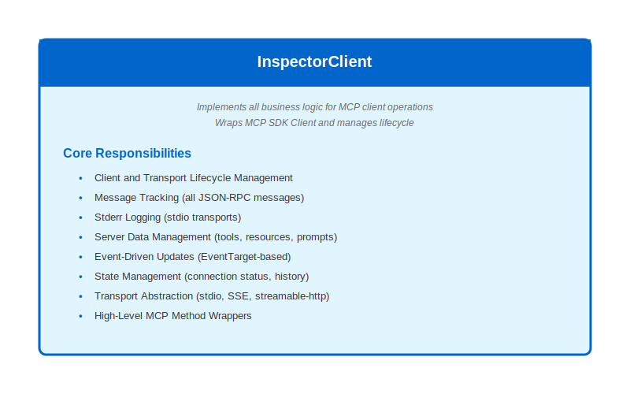

# Shared Code Architecture for MCP Inspector

## Overview

This document describes a shared code architecture that enables code reuse across the MCP Inspector's three user interfaces: the **CLI**, **TUI** (Terminal User Interface), and **web client** (likely targeting v2). The shared codebase approach prevents the feature drift and maintenance burden that can occur when each app has a separate implementation.

### Environment Isolation

The architecture uses **environment isolation** to separate portable JavaScript from environment-specific code (Node.js vs. browser). `InspectorClient` is portable and accepts **injected dependencies** (seams) for environment-specific behavior:

- **CLI/TUI (Node)**: Inject Node-specific implementations (`createTransportNode`, `NodeOAuthStorage`, file-based logging)
- **Web client (Browser)**: Inject browser-specific implementations (`createRemoteTransport`, `BrowserOAuthStorage` or `RemoteOAuthStorage`, remote logging)

`InspectorClient` remains unaware of which environment it's running in—it just uses the injected dependencies. This allows the same code to run in Node (CLI, TUI) and browser (web client). See [environment-isolation.md](environment-isolation.md) for detailed design.

### Motivation

Previously, the CLI and web client had no shared code, leading to:

- **Feature drift**: Implementations diverged over time
- **Maintenance burden**: Bug fixes and features had to be implemented twice
- **Inconsistency**: Different behavior across interfaces
- **Duplication**: Similar logic implemented separately in each interface

Adding the TUI (as-is) with yet another separate implementation seemed problematic given the above.

The shared code architecture addresses these issues by providing a single source of truth for MCP client operations that all three interfaces can use.

## Proposed Architecture

### Architecture Diagram


**Key concept**: Each environment (CLI, TUI, web client) injects environment-specific dependencies into `InspectorClient`:

- **CLI/TUI**: Pass `environment` object with `transport: createTransportNode` (creates stdio, SSE, streamable-http transports directly in Node), `oauth.storage: NodeOAuthStorage` (file-based), `logger` (file-based pino logger)
- **Web client**: Pass `environment` object with `transport: createRemoteTransport` (creates `RemoteClientTransport` that talks to remote API server), `fetch: createRemoteFetch`, `logger: createRemoteLogger`, `oauth.storage: BrowserOAuthStorage` or `RemoteOAuthStorage` (sessionStorage or HTTP API)

`InspectorClient` uses these injected dependencies to create transports and manage OAuth, remaining portable across all environments.

### Protocol and state managers

`InspectorClient` is the **protocol layer**: it owns the connection, exposes list RPCs (stateless), and dispatches events. **List and log state** (tools, resources, prompts, requestor tasks, messages, fetch requests, stderr) live in **optional state managers** in `core/mcp/state/`. Apps create an `InspectorClient` and only the state managers they need (e.g. `PagedToolsState`, `MessageLogState`); React hooks in `core/react/` subscribe to those managers. See [protocol-and-state-managers-architecture.md](protocol-and-state-managers-architecture.md) for the full design.

### Project Structure

```
inspector/
├── cli/              # CLI workspace (uses shared code)
├── tui/              # TUI workspace (uses shared code)
├── web/              # Web client workspace (uses shared code)
├── core/              # Shared code workspace package
│   ├── mcp/           # InspectorClient (protocol) + state managers
│   │   └── state/     # Optional state managers (tools, resources, logs, tasks)
│   ├── react/         # useInspectorClient + hooks per state manager
│   ├── json/          # JSON utilities
│   └── auth/          # OAuth infrastructure
└── package.json       # Root workspace config
```

### Shared Package (`@modelcontextprotocol/inspector-core`)

The `core/` directory is a **workspace package** that:

- **Private** (`"private": true`) - internal-only, not published
- **Built separately** - compiles to `core/build/` with TypeScript declarations
- **Referenced via package name** - workspaces import using `@modelcontextprotocol/inspector-core/*`
- **Uses TypeScript Project References** - CLI and TUI reference shared for build ordering and type resolution
- **React peer dependency** - declares React 19.2.3 as peer dependency (consumers provide React)

**Build Order**: Shared must be built before CLI and TUI (enforced via TypeScript Project References and CI workflows).

## InspectorClient: The Core Shared Component

### Overview

`InspectorClient` (`core/mcp/inspectorClient.ts`) is the **protocol layer** around the MCP SDK `Client`: it owns the connection and transport, exposes list RPCs (stateless), and dispatches events. **List and log state** (tools, resources, prompts, tasks, messages, fetch requests, stderr) are held by **optional state managers** (`core/mcp/state/`); see [protocol-and-state-managers-architecture.md](protocol-and-state-managers-architecture.md). InspectorClient provides:

- **Unified Client Interface**: Single class for connection and all MCP operations
- **Client and Transport Lifecycle**: Creates and manages MCP SDK `Client` and `Transport`; `connect()` / `disconnect()`
- **Event-Driven Protocol**: Uses `EventTarget`; dispatches signal events (`*ListChanged`, `taskStatusChange`, `message`, `fetchRequest`, `stderrLog`, etc.) so state managers can subscribe
- **List RPCs (stateless)**: `listTools`, `listResources`, `listPrompts`, `listRequestorTasks`, etc.—return data only; no internal cache
- **Server Metadata**: Holds capabilities, serverInfo, instructions; dispatches change events
- **Transport Abstraction**: Works with all `Transport` types (stdio, SSE, streamable-http)
- **High-Level Methods**: Wrappers for tools/call, readResource, getPrompt, createMessage, elicit, and other MCP methods



### Key Features

**Connection Management:**

- `connect()` - Establishes connection; registers notification handlers and fetches server metadata
- `disconnect()` - Closes connection and clears references
- Connection status tracking (`disconnected`, `connecting`, `connected`, `error`)

**Protocol events (list and log data):**

- InspectorClient dispatches **per-entry** and **signal** events (e.g. `message`, `fetchRequest`, `stderrLog`, `toolsListChanged`, `taskStatusChange`). **State managers** subscribe to these, hold lists (messages, tools, resources, tasks, etc.), and dispatch their own change events; React hooks subscribe to the managers. List and log state are not stored on InspectorClient. See [protocol-and-state-managers-architecture.md](protocol-and-state-managers-architecture.md).

**Request and stderr events:**

- Dispatches `fetchRequest` (per entry) and `stderrLog` (per entry) so log state managers (`FetchRequestLogState`, `StderrLogState`) can append and hold the lists. InspectorClient does not store message, fetch, or stderr lists.

**MCP Method Wrappers:**

- `listTools(metadata?)` - List available tools
- `callTool(name, args, generalMetadata?, toolSpecificMetadata?)` - Call a tool with automatic parameter conversion
- `listResources(metadata?)` - List available resources
- `readResource(uri, metadata?)` - Read a resource by URI
- `listResourceTemplates(metadata?)` - List resource templates
- `listPrompts(metadata?)` - List available prompts
- `getPrompt(name, args?, metadata?)` - Get a prompt with automatic argument stringification
- `getCompletions(resourceUri, prompt, metadata?)` - Get completions for resource templates or prompts
- `getRoots()` - List roots
- `setRoots(roots)` - Set roots
- `setLoggingLevel(level)` - Set logging level with capability checks

**Advanced Features:**

- **OAuth 2.1** - Full OAuth support (static client, DCR, CIMD, guided auth) with injectable storage, navigation, and redirect URL providers
- **Sampling** - Handles sampling requests, tracks pending samples, dispatches `newPendingSample` events
- **Elicitation** - Handles elicitation requests (form and URL), tracks pending elicitations, dispatches `newPendingElicitation` events
- **Roots** - Manages roots capability, handles `roots/list` requests, dispatches `rootsChange` events
- **Progress Notifications** - Handles progress notifications, dispatches `progressNotification` events, resets request timeout on progress
- **ListChanged Notifications** - Automatically reloads tools/resources/prompts when `listChanged` notifications are received

**Configurable Options:**

- `autoFetchServerContents` - Controls whether to auto-fetch tools/resources/prompts on connect (default: `true` for TUI, `false` for CLI)
- `initialLoggingLevel` - Sets the logging level on connect if server supports logging (optional)
- `maxMessages` - Maximum number of messages to store (default: 1000)
- `maxStderrLogEvents` - Maximum number of stderr log entries to store (default: 1000)
- `maxFetchRequests` - Maximum number of fetch requests to store (default: 1000)
- `pipeStderr` - Whether to pipe stderr for stdio transports (default: `false`; TUI and CLI set this explicitly)

### Event System

`InspectorClient` extends `EventTarget` for cross-platform compatibility. It dispatches **signal** and **per-entry** events; state managers subscribe and hold list state. Events include:

- **Connection:** `statusChange`, `connect`, `disconnect`
- **Server metadata:** `capabilitiesChange`, `serverInfoChange`, `instructionsChange`
- **List signals:** `toolsListChanged`, `resourcesListChanged`, `promptsListChanged`, `tasksListChanged`, `taskStatusChange`, `requestorTaskUpdated`, `taskCancelled`
- **Log (per-entry):** `message`, `fetchRequest`, `stderrLog`
- **Other:** `error`, OAuth events, etc.

State managers emit their own change events (e.g. `toolsChange`, `messagesChange`) with the current list. See [protocol-and-state-managers-architecture.md](protocol-and-state-managers-architecture.md).

### Shared Module Structure

The shared package is organized with environment-specific code separated into `node/` and `browser/` subdirectories. Portable code (no environment-specific APIs) lives in module roots; Node-specific code is under `node/` subdirectories; browser-specific code is under `browser/` subdirectories.

**Main modules:**

- **`core/mcp/`** - `InspectorClient` (protocol) and MCP types, transport, config
- **`core/mcp/state/`** - Optional state managers (Managed*/Paged* for tools, resources, prompts, tasks; MessageLogState, FetchRequestLogState, StderrLogState). See [protocol-and-state-managers-architecture.md](protocol-and-state-managers-architecture.md).
- **`core/mcp/remote/`** - Remote transport infrastructure (portable client code)
- **`core/auth/`** - OAuth infrastructure (portable base code)
- **`core/react/`** - `useInspectorClient` and hooks per state manager (`usePagedTools`, `useMessageLog`, etc.)
- **`core/json/`** - JSON utilities
- **`core/storage/`** - Storage abstraction layer

For detailed module organization, environment-specific modules, and package exports, see [environment-isolation.md](environment-isolation.md).

## Integration History

### Phase 1: TUI Integration (Complete)

The TUI was integrated from the [`mcp-inspect`](https://github.com/TeamSparkAI/mcp-inspect) project as a standalone workspace. During integration, the TUI developed `InspectorClient` as a comprehensive client wrapper, providing a good foundation for code sharing.

**Key decisions:**

- TUI developed `InspectorClient` to wrap MCP SDK `Client`
- Organized MCP code into `tui/src/mcp/` module
- Created React hook `useInspectorClient` for reactive state management

### Phase 2: Extract to Shared Package (Complete)

All MCP-related code was moved from TUI to `core/` to enable reuse:

**Moved to `core/mcp/`:**

- `inspectorClient.ts` - Main client wrapper
- `transport.ts` - Transport creation
- `config.ts` - Config loading
- `types.ts` - Shared types
- `messageTrackingTransport.ts` - Message tracking wrapper

**Moved to `core/react/`:**

- `useInspectorClient.ts` - React hook

**Moved to `core/test/`:**

- Test fixtures and harness servers (from CLI tests)

**Configuration:**

- Created `core/package.json` as workspace package
- Configured TypeScript Project References
- Set React 19.2.3 as peer dependency
- Aligned all workspaces to React 19.2.3

### Phase 3: CLI Migration (Complete)

The CLI was migrated to use `InspectorClient` from the shared package:

**Changes:**

- Replaced direct SDK `Client` usage with `InspectorClient`
- Moved CLI helper functions (`tools.ts`, `resources.ts`, `prompts.ts`) into `InspectorClient` as methods
- Extracted JSON utilities to `core/json/jsonUtils.ts`
- Deleted `cli/src/client/` directory
- Implemented local `argsToMcpServerConfig()` function in CLI to convert CLI arguments to `MCPServerConfig`
- CLI now uses `inspectorClient.listTools()`, `inspectorClient.callTool()`, etc. directly

**Configuration:**

- CLI sets `autoFetchServerContents: false` (calls methods directly)
- CLI sets `initialLoggingLevel: "debug"` for consistent logging

## Current Usage

### CLI Usage

The CLI uses `InspectorClient` for all MCP operations:

```typescript
// Convert CLI args to MCPServerConfig
const config = argsToMcpServerConfig(args);

// Create InspectorClient
const inspectorClient = new InspectorClient(config, {
  clientIdentity,
  autoFetchServerContents: false, // CLI calls methods directly
  initialLoggingLevel: "debug",
});

// Connect and use
await inspectorClient.connect();
const result = await inspectorClient.listTools(args.metadata);
await inspectorClient.disconnect();
```

### TUI Usage

The TUI uses `InspectorClient` via the `useInspectorClient` React hook:

```typescript
// In TUI component
const { status, messages, tools, resources, prompts, connect, disconnect } =
  useInspectorClient(inspectorClient);

// InspectorClient is created from config and managed by App.tsx
// The hook automatically subscribes to events and provides reactive state
```

**TUI Configuration:**

- Sets `autoFetchServerContents: true` (default) - automatically fetches server data on connect
- Uses `useInspectorClient` hook for reactive UI updates
- `ToolTestModal` uses `inspectorClient.callTool()` directly

**TUI Status:**

- **Experimental**: The TUI functionality may be considered "experimental" until sufficient testing and review of features and implementation. This allows for iteration and refinement based on user feedback before committing to a stable feature set.
- **Feature parity**: The TUI now supports OAuth (static client, CIMD, DCR, guided auth), completions, elicitation, sampling, and HTTP request tracking. InspectorClient provides all of these.

**Entry Point:**
The TUI is invoked via the main `mcp-inspector` command with a `--tui` flag:

- `mcp-inspector --tui ...` → TUI mode
- `mcp-inspector --cli ...` → CLI mode
- `mcp-inspector ...` → Web client mode (default)

This provides a single entry point with consistent argument parsing across all three UX modes.

## Phase 4: TUI Feature Gaps (Complete)

InspectorClient supports OAuth (static client, CIMD, DCR, guided auth), completions (`getCompletions`), elicitation (pending elicitations, `newPendingElicitation` event), sampling (pending samples, `newPendingSample` event), roots (`getRoots`, `setRoots`), progress notifications, and custom headers via `MCPServerConfig`. For details on which features are implemented in the TUI vs. web client, see [tui-web-client-feature-gaps.md](tui-web-client-feature-gaps.md).

## InspectorClient Readiness for Web App

### Current State

InspectorClient is **close to ready** for web app support. The core functionality matches what the web client needs:

| Capability                | InspectorClient                                                                          | Web Client useConnection                                            |
| ------------------------- | ---------------------------------------------------------------------------------------- | ------------------------------------------------------------------- |
| Connection management     | ✅ `connect()`, `disconnect()`, status events                                            | ✅                                                                  |
| Tools, resources, prompts | ✅ Auto-fetch, events, methods                                                           | ✅                                                                  |
| Message tracking          | ✅ `MessageEntry[]`, `messagesChange`                                                    | Different format (`{ request, response }[]`)                        |
| OAuth                     | ✅ Injected via `environment.oauth` (storage, navigation, redirect), `environment.fetch` | ✅ Own flow, session storage                                        |
| Custom headers            | ✅ `headers` in SSE/streamable-http config                                               | ✅                                                                  |
| Elicitation               | ✅ Pending elicitations, events                                                          | ✅                                                                  |
| Completion                | ✅ `getCompletions()`                                                                    | ✅                                                                  |
| Sampling                  | ✅ Pending samples, events                                                               | ✅                                                                  |
| Roots                     | ✅ `getRoots()`, `setRoots()`, events                                                    | ✅                                                                  |
| Progress                  | ✅ `progressNotification` event, timeout reset                                           | ✅                                                                  |
| Request history           | ✅ Auth + transport request tracking                                                     | ✅ Request history                                                  |
| Logger                    | ✅ Optional injected (pino)                                                              | —                                                                   |
| Transport factory         | ✅ Required `CreateTransport`                                                            | Creates transports directly (web servers) or via proxy (stdio/CORS) |

### Environment Isolation: What's Done vs. Pending

Per [environment-isolation.md](environment-isolation.md):

**Implemented:** All environment-specific dependencies are consolidated into `InspectorClientEnvironment` (transport, fetch, logger, oauth.storage, oauth.navigation, oauth.redirectUrlProvider). Transport is required; fetch, logger, and OAuth components are optional. Node uses `createTransportNode`; browser uses `createRemoteTransport`, `createRemoteFetch`, `createRemoteLogger`. The shared package works in Node (CLI, TUI).

**Implemented (remote infrastructure):**

- **Hono API server** — In `core/mcp/remote/node/`. Endpoints for transport (`/api/mcp/connect`, `send`, `events`, `disconnect`), proxy fetch (`/api/fetch`), logging (`/api/log`), and storage (`/api/storage/:storeId`).
- **createRemoteTransport + RemoteClientTransport** — In `core/mcp/remote/` (portable). Browser transport that talks to the remote server.
- **createRemoteFetch** — In `core/mcp/remote/`. Fetch that POSTs to `/api/fetch` for OAuth (CORS bypass).
- **createRemoteLogger** — In `core/mcp/remote/`. Pino logger that POSTs to `/api/log` via `pino/browser` transmit.
- **Storage abstraction** — `FileStorageAdapter` (Node), `RemoteStorageAdapter` (browser), `RemoteOAuthStorage` (HTTP API). All OAuth storage implementations use Zustand persist middleware for consistency.
- **Generic storage API** — `GET/POST/DELETE /api/storage/:storeId` endpoints for shared on-disk state between web app and TUI/CLI. See [environment-isolation.md](environment-isolation.md).
- **Node code organization** — `core/auth/node/`, `core/mcp/node/`, `core/mcp/remote/node/`.

**Summary:** InspectorClient and the remote infrastructure (Hono API, createRemoteTransport, createRemoteFetch, createRemoteLogger, storage API) are implemented. The remaining effort is:

1. Integrating `createRemoteApp` (Hono) into the Vite dev server as middleware
2. Refactoring the web client to use InspectorClient + `createRemoteTransport` instead of `useConnection`
3. Removing the separate Express server once integration is complete

## Web Client Integration Plan

### Current Web Client Architecture

The web client currently uses `useConnection` hook (`client/src/lib/hooks/useConnection.ts`) that handles:

1. **Connection Management**
   - Connection status state (`disconnected`, `connecting`, `connected`, `error`, `error-connecting-to-proxy`)
   - Direct vs. proxy connection modes
   - Proxy health checking

2. **Transport Creation**
   - Creates SSE or StreamableHTTP transports directly
   - Handles proxy mode (connects to proxy server endpoints)
   - Handles direct mode (connects directly to MCP server)
   - Manages transport options (headers, fetch wrappers, reconnection options)

3. **OAuth Authentication**
   - Browser-based OAuth flow (authorization code flow)
   - OAuth token management via `InspectorOAuthClientProvider`
   - Session storage for OAuth tokens
   - OAuth callback handling
   - Token refresh

4. **Custom Headers**
   - Custom header management (migration from legacy auth)
   - Header validation
   - OAuth token injection into headers
   - Special header processing (`x-custom-auth-headers`)

5. **Request/Response Tracking**
   - Request history (`{ request: string, response?: string }[]`)
   - History management (`pushHistory`, `clearRequestHistory`)
   - Different format than InspectorClient's `MessageEntry[]`

6. **Notification Handling**
   - Notification handlers via callbacks (`onNotification`, `onStdErrNotification`)
   - Multiple notification schemas (Cancelled, Logging, ResourceUpdated, etc.)
   - Fallback notification handler

7. **Request Handlers**
   - Elicitation request handling (`onElicitationRequest`)
   - Pending request handling (`onPendingRequest`)
   - Roots request handling (`getRoots`)

8. **Completion Support**
   - Completion capability detection
   - Completion state management

9. **Progress Notifications**
   - Progress notification handling
   - Timeout reset on progress

10. **Session Management**
    - Session ID tracking (`mcpSessionId`)
    - Protocol version tracking (`mcpProtocolVersion`)
    - Response header capture

11. **Server Information**
    - Server capabilities
    - Server implementation info
    - Protocol version

12. **Error Handling**
    - Proxy auth errors
    - OAuth errors
    - Connection errors
    - Retry logic

The main `App.tsx` component manages extensive state including:

- Resources, resource templates, resource content
- Prompts, prompt content
- Tools, tool results
- Errors per tab
- Connection configuration (command, args, sseUrl, transportType, etc.)
- OAuth configuration
- Custom headers
- Notifications
- Roots
- Environment variables
- Log level
- Active tab
- Pending requests

### Integration Challenges

**1. OAuth Authentication**

- Web client uses browser-based OAuth flow (authorization code with PKCE)
- Requires browser redirects and callback handling
- **Solution**: InspectorClient supports injectable OAuth components via `environment.oauth` (storage, navigation, redirectUrlProvider) and `environment.fetch` for auth requests. Web client injects `BrowserOAuthStorage` or `RemoteOAuthStorage`, `BrowserNavigation`, and a redirect provider using `window.location.origin`. The web app implements its own `oauth/callback` route.

**2. Remote Transport**

- Web client must use remote transports for all transport types (stdio, SSE, streamable-http)
- **Solution**: Use `createRemoteTransport` as the transport factory. This handles all transport types via the remote API server.

**3. Custom Headers**

- Web client manages custom headers (OAuth tokens, custom auth headers)
- **Solution**: `MCPServerConfig` already supports `headers` in `SseServerConfig` and `StreamableHttpServerConfig`

**4. Request History Format**

- Web client uses `{ request: string, response?: string }[]`
- `InspectorClient` uses `MessageEntry[]` (more detailed)
- **Solution**: Migrate web client to use `MessageEntry[]` format

**5. Completion Support**

- Web client detects and manages completion capability
- **Solution**: Use `inspectorClient.getCapabilities()?.completions` to detect support, access SDK client via `getClient()` for completion requests

**6. Elicitation and Request Handlers**

- Web client sets request handlers for elicitation, pending requests, roots
- **Solution**: Use `inspectorClient.getClient()` to set request handlers (minimal change)

**7. Progress Notifications**

- Web client handles progress notifications and timeout reset
- **Solution**: Handle progress via existing notification system (`InspectorClient` already tracks notifications)

**8. Session Management**

- Web client tracks session ID and protocol version
- **Solution**: Access transport via `inspectorClient.getClient()` to get session info

### Integration Strategy

InspectorClient already has the needed features (see "InspectorClient Readiness for Web App" above). The remaining integration work is:

1. **Integrate Hono server into Vite** — Mount `createRemoteApp` (Hono) as middleware in the Vite dev server. This eliminates the need for a separate Express server. The Hono app handles all `/api/*` routes (`/api/mcp/*`, `/api/fetch`, `/api/log`, `/api/storage/*`) on the same origin as the web client.
2. **Web-specific adapters** — Create adapter that converts web client config to `MCPServerConfig` and manages OAuth token injection into headers. Use `createRemoteTransport` as the transport factory, `createRemoteFetch` (POST to `/api/fetch`) for OAuth, `createRemoteLogger` (POST to `/api/log`) for logging, and OAuth providers (`BrowserOAuthStorage`, `BrowserNavigation`, or `RemoteOAuthStorage` for shared state).
3. **Replace useConnection** — Use `InspectorClient` + `useInspectorClient` instead of `useConnection`; migrate state and request history to `MessageEntry[]`; wire OAuth via web app's `oauth/callback` route.
4. **Remove Express server** — Delete or deprecate the separate Express server (`server/` directory) once Hono is integrated into Vite and the web client is ported.

### Benefits of Web Client Integration

1. **Code Reuse**: Share MCP client logic across all three interfaces, including the shared React hook (`useInspectorClient`) between TUI and web client
2. **Consistency**: Same behavior across CLI, TUI, and web client
3. **Maintainability**: Single source of truth for MCP operations
4. **Features**: Web client gets message tracking, stderr logging, event-driven updates
5. **Type Safety**: Shared types ensure consistency
6. **Testing**: Shared code is tested once, works everywhere

### Implementation Steps

The remote infrastructure is complete (Hono API server, `createRemoteTransport`, `createRemoteFetch`, `createRemoteLogger`, storage abstraction, Node code organization). Remaining steps:

1. **Integrate Hono into Vite dev server** — Mount `createRemoteApp` as middleware in Vite configuration. Configure auth token, storage directory, and optional origin validation. This eliminates the separate Express server.
2. **Create adapter** — Convert web client config to `MCPServerConfig`; use `createRemoteTransport` as transport factory, `createRemoteFetch` for OAuth, `createRemoteLogger` for logging, and OAuth providers (`BrowserOAuthStorage`, `BrowserNavigation`, or `RemoteOAuthStorage` for shared state).
3. **Replace useConnection** — Use `InspectorClient` + `useInspectorClient` instead of `useConnection`; migrate state to `MessageEntry[]` format.
4. **Remove Express server** — Delete `server/` directory and update startup scripts once integration is complete.

## Summary

The shared code architecture provides:

- **Single source of truth** for MCP client operations via `InspectorClient`
- **Code reuse** across CLI, TUI, and (planned) web client
- **Consistent behavior** across all interfaces
- **Reduced maintenance burden** - fix once, works everywhere
- **Type safety** through shared types
- **Event-driven updates** via EventTarget (cross-platform compatible)

**Current Status:**

- ✅ Phase 1: TUI integrated and using shared code
- ✅ Phase 2: Shared package created and configured
- ✅ Phase 3: CLI migrated to use shared code
- ✅ Phase 4: InspectorClient feature support added (OAuth, completions, elicitation, sampling, etc.). See [tui-web-client-feature-gaps.md](tui-web-client-feature-gaps.md) for TUI implementation status.
- 🔄 Phase 5: v2 web client integration (planned)

**Next Steps:**

1. Integrate `InspectorClient` with v2 web client: replace `useConnection` with `InspectorClient` + `useInspectorClient`, add adapters for config conversion and OAuth providers, wire OAuth providers
