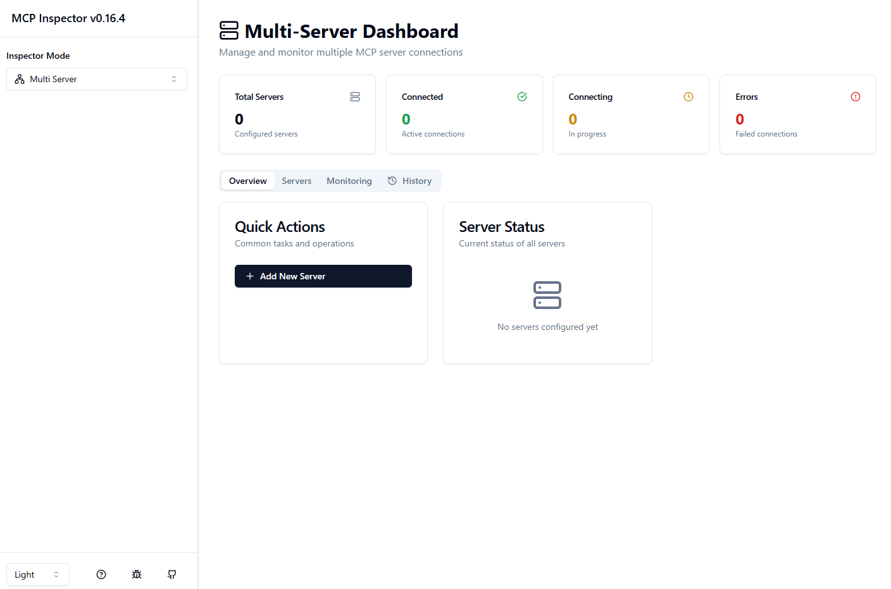
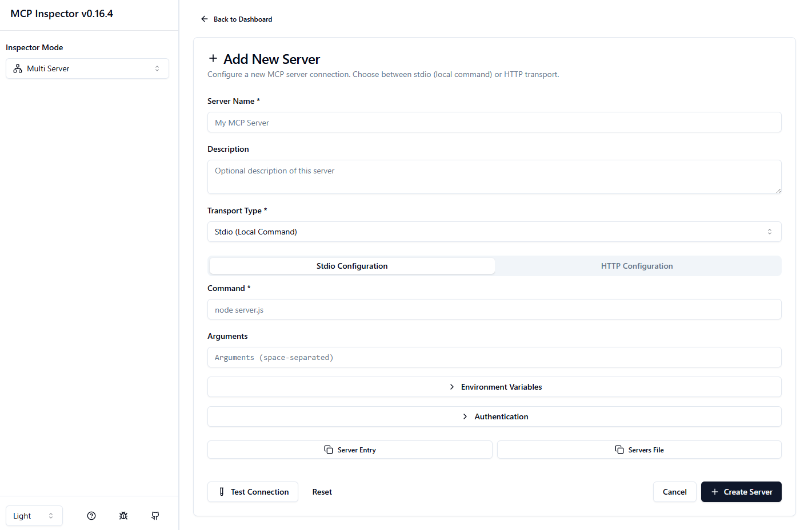
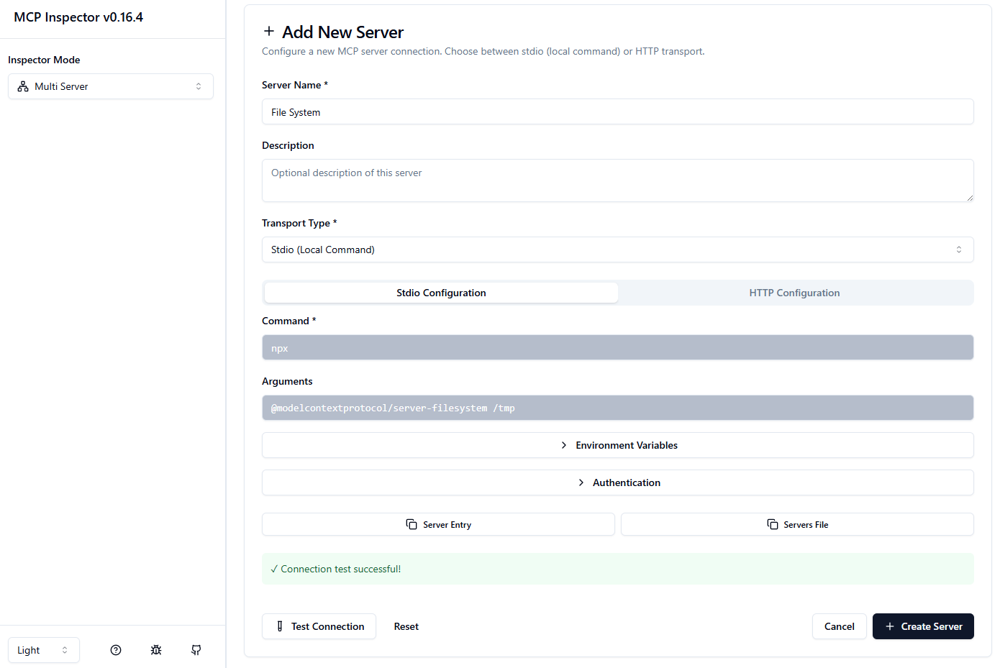
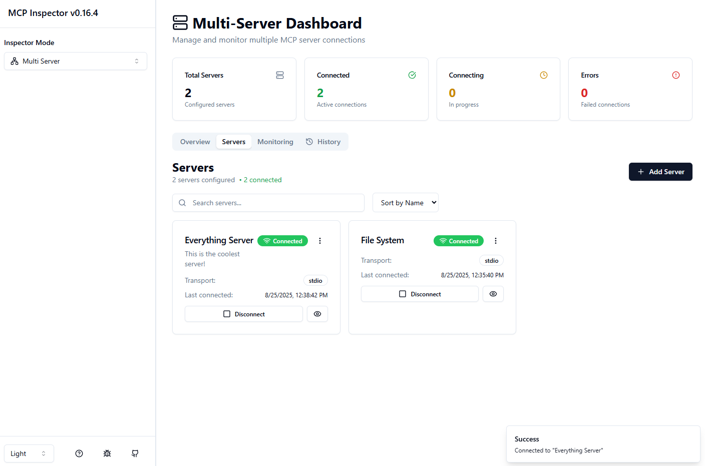
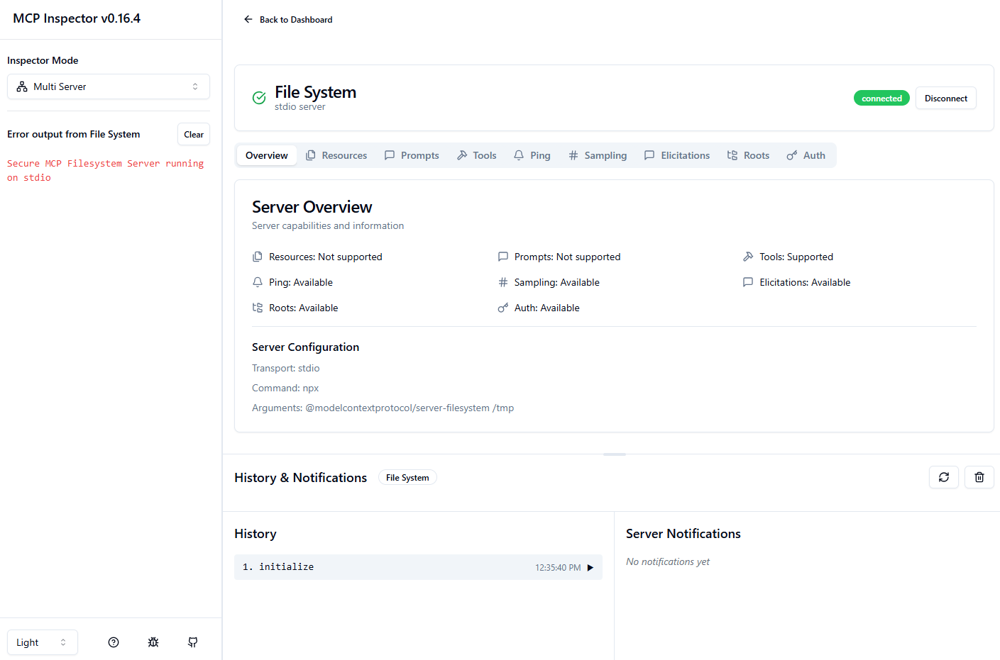
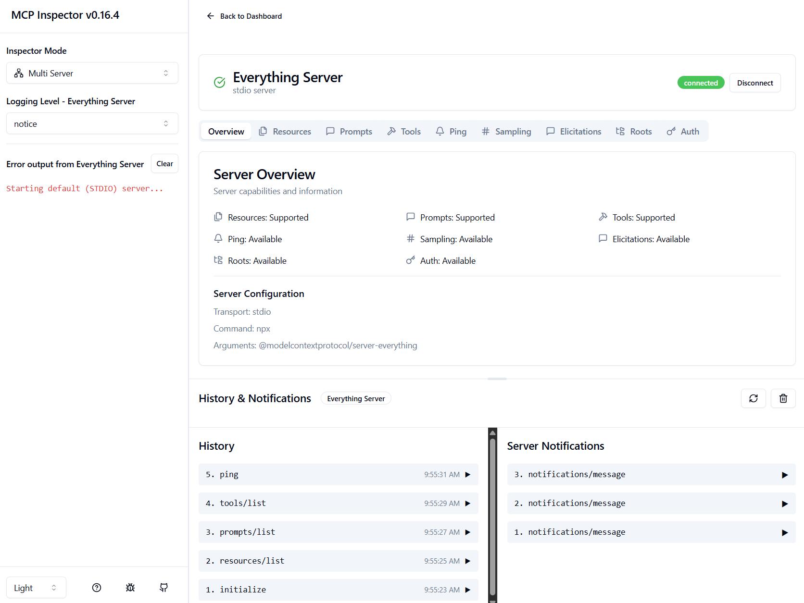
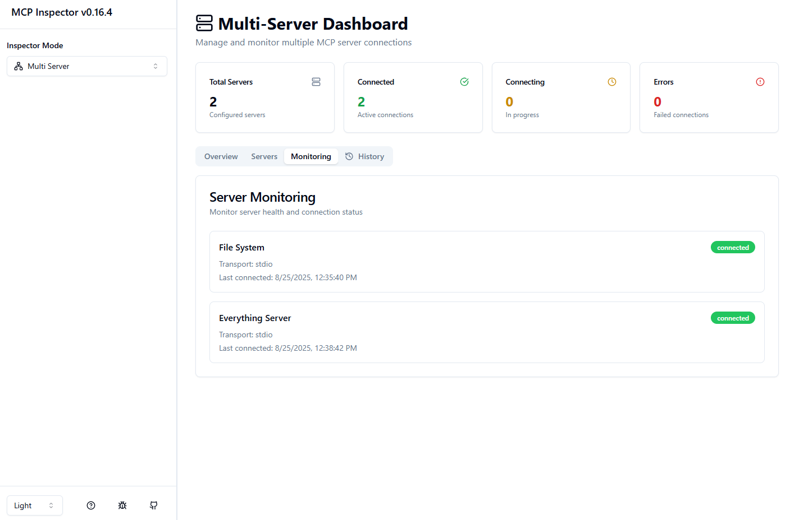
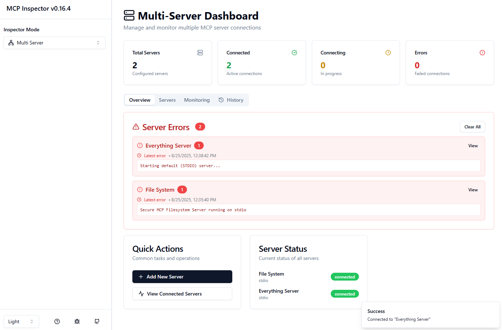
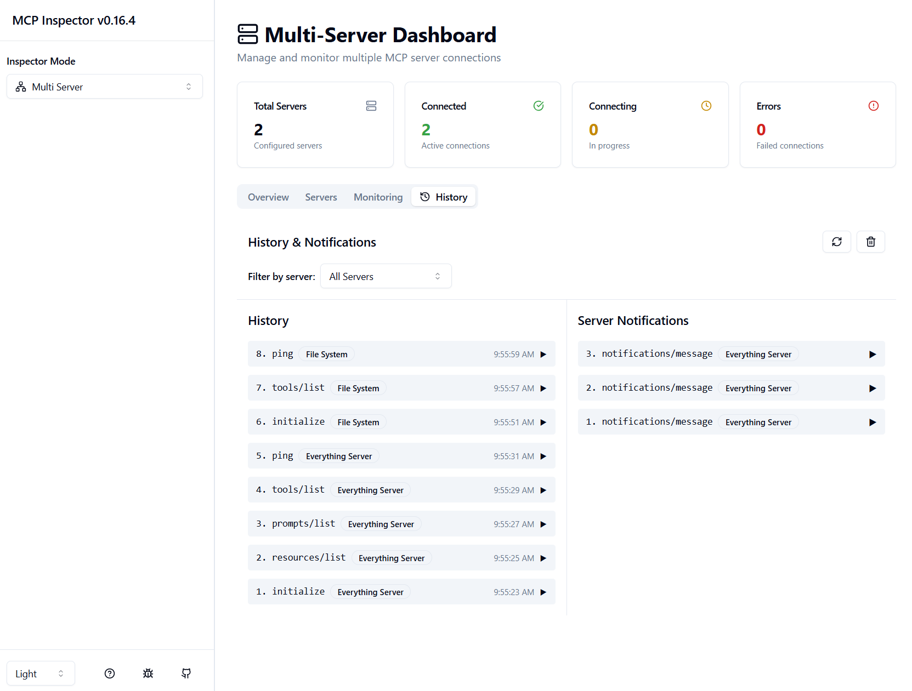
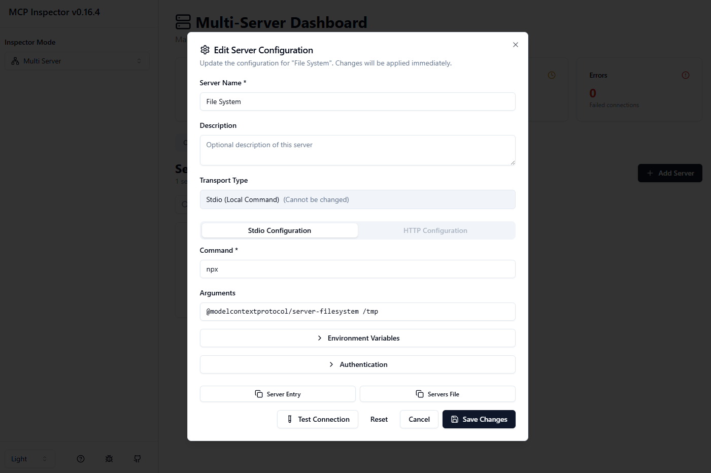

# Multi-Server Support for MCP Inspector

## Overview

This pull request introduces comprehensive multi-server support to the MCP Inspector, transforming it from a single-server debugging tool into a powerful multi-server management platform. This enhancement addresses the growing need for developers to work with multiple MCP servers simultaneously while maintaining full backward compatibility with existing workflows.

## Problem Statement

The original MCP Inspector was designed to work with a single MCP server at a time, which created several limitations for developers:

1. **Context Switching Overhead**: Developers working with multiple MCP servers had to manually reconfigure and restart the inspector for each server, breaking their workflow
2. **No Comparative Analysis**: Unable to compare capabilities, resources, or tools across different servers in a unified interface
3. **Limited Scalability**: As MCP ecosystems grow, developers need to manage increasingly complex server configurations
4. **Isolated Debugging**: Each server had to be debugged in isolation, making it difficult to understand interactions between servers
5. **Configuration Management**: No centralized way to manage multiple server configurations and their connection states

## Solution Overview

We implemented a comprehensive multi-server architecture that extends the MCP Inspector with:

### 🏗️ **Server-Side Architecture**
- **Multi-Server API**: RESTful endpoints for server management, connection control, and MCP request proxying
- **Real-Time Event Streaming**: Server-Sent Events for live status updates and notifications across all servers
- **Connection Management**: Independent connection lifecycle management for each server
- **Centralized Logging**: Synchronized logging level management across all connected servers
- **Transport Flexibility**: Support for both STDIO and HTTP transport types in multi-server configurations

### 🎨 **Client-Side Interface**
- **Unified Dashboard**: Tabbed interface for managing multiple servers with real-time status monitoring
- **Server Management**: Complete CRUD operations for server configurations with validation
- **Error Aggregation**: Sophisticated error handling with console error interception and deduplication
- **State Persistence**: LocalStorage-based configuration management with cache invalidation
- **Mode Switching**: Seamless toggle between single-server and multi-server modes

## Technical Implementation

### Backend Implementation (`server/src/multiserver/`)

The server-side implementation follows a modular architecture:

```
server/src/multiserver/
├── models/                 # Type definitions and data models
├── services/              # Business logic services
├── utils/                 # Utility functions and helpers
├── middleware/            # Express middleware
├── routes/               # REST API endpoints
└── __tests__/           # Comprehensive test suite
```

**Key Components:**

- **ServerManager**: Handles CRUD operations for server configurations with Zod validation
- **ConnectionManager**: Manages connection lifecycle, status tracking, and transport creation
- **EventStreamService**: Provides real-time updates via Server-Sent Events
- **MCP Proxy**: Unified API for communicating with individual servers without direct client connections

For detailed technical documentation, see [`server/src/multiserver/README.md`](server/src/multiserver/README.md).

### Frontend Implementation (`client/src/components/multiserver/`)

The client-side implementation provides a rich, interactive interface:

```
client/src/components/multiserver/
├── hooks/                # Custom React hooks for state management
├── services/            # API communication layer
├── stores/              # Centralized data stores
├── types/               # TypeScript definitions
├── utils/               # Utility functions and helpers
└── [React Components]   # UI components
```

**Key Features:**

- **useMultiServer Hook**: 600+ lines of comprehensive state management with real-time updates
- **Error Management**: Sophisticated error aggregation with console interception
- **Request Optimization**: Deduplication and batching for improved performance
- **History Management**: Centralized notification and interaction tracking

For detailed technical documentation, see [`client/src/components/multiserver/README.md`](client/src/components/multiserver/README.md).

## Visual Demonstration

### Dashboard Overview
The multi-server dashboard provides a comprehensive view of all configured servers:


*Initial dashboard state showing the clean, organized interface*

### Server Management
Users can easily add new servers with support for both STDIO and HTTP transports:


*Clean form interface for adding new server configurations*


*Example configuration for a file system server with STDIO transport*

### Multi-Server Operations
The interface supports managing multiple servers simultaneously:


*Dashboard showing multiple configured servers with status indicators*

### Server Interaction
Each server provides dedicated tabs for resources, tools, and prompts:


*Individual server interface showing available resources and tools*


*Example of a fully configured server with multiple capabilities*

### Monitoring and Error Handling
Comprehensive monitoring and error tracking across all servers:


*Real-time monitoring dashboard with server health indicators*


*Error tracking and aggregation across multiple servers*


*Centralized history and notification management*

### Configuration Management
Easy server configuration editing with validation:


*Modal interface for editing existing server configurations*

## Key Features

### 🔄 **Real-Time Updates**
- Server-Sent Events provide instant feedback on connection changes
- Live error tracking and notification streaming
- Automatic status synchronization across all servers

### 🛠️ **Server Management**
- Create, read, update, and delete server configurations
- Support for STDIO and HTTP transport types
- Configuration validation with detailed error messages

### 🔌 **Connection Control**
- Independent connection management for each server
- Bulk operations (connect all, disconnect all)
- Connection status tracking with health indicators

### 📊 **Monitoring & Debugging**
- Error aggregation with console error interception
- Centralized logging level management
- Request/response history tracking
- Performance metrics and statistics

### 💾 **State Persistence**
- LocalStorage-based configuration management
- Cache invalidation for data consistency
- State merging for API synchronization

### 🔒 **Security & Reliability**
- Authentication middleware with timing-safe token comparison
- Input validation using Zod schemas
- Comprehensive error handling and recovery
- Resource cleanup on shutdown

## Backward Compatibility

**Full backward compatibility maintained:**
- Existing single-server endpoints remain unchanged
- No breaking changes to API contracts
- Existing client code continues working without modification
- Seamless mode switching between single and multi-server modes

## API Reference

### Core Endpoints

**Server Management** (`/api/servers`)
- `GET /api/servers` - List all servers
- `POST /api/servers` - Create server
- `GET /api/servers/:id` - Get server by ID
- `PUT /api/servers/:id` - Update server
- `DELETE /api/servers/:id` - Delete server

**Connection Management** (`/api/connections`)
- `GET /api/connections` - Get all connection statuses
- `POST /api/connections/:id/connect` - Connect to server
- `POST /api/connections/:id/disconnect` - Disconnect from server

**MCP Proxy** (`/api/mcp`)
- `POST /api/mcp/:id/request` - Generic MCP request
- `GET /api/mcp/:id/resources` - List resources
- `GET /api/mcp/:id/tools` - List tools
- `GET /api/mcp/:id/prompts` - List prompts

**Event Streaming** (`/api/events`)
- `GET /api/events` - Subscribe to real-time event stream

## Testing

### Comprehensive Test Coverage
- **Server-Side**: 40+ unit tests covering all services and utilities
- **Client-Side**: Component tests and integration tests
- **HTTP API Testing**: Complete endpoint testing with `.http` files
- **Error Handling**: Edge case and failure scenario testing

### Test Categories
- ServerManager: CRUD operations, validation, error handling
- ConnectionManager: Lifecycle management, status tracking, errors
- LoggingLevelManager: Synchronization and cleanup
- UI Components: User interactions and state management

## Usage

### Getting Started
1. Start the MCP Inspector: `npx @modelcontextprotocol/inspector`
2. Open the web interface at `http://localhost:6274`
3. Use the mode toggle in the sidebar to switch to "Multi Server" mode
4. Add your first server using the "Add Server" button

### Example Server Configuration

**STDIO Server:**
```json
{
  "name": "File System Server",
  "description": "Local file system access",
  "transportType": "stdio",
  "config": {
    "command": "npx",
    "args": ["@modelcontextprotocol/server-filesystem", "/path/to/directory"],
    "env": {"DEBUG": "true"}
  }
}
```

**HTTP Server:**
```json
{
  "name": "Remote API Server",
  "description": "Remote MCP server via HTTP",
  "transportType": "streamable-http",
  "config": {
    "url": "https://api.example.com/mcp"
  }
}
```

## Impact

This multi-server implementation transforms the MCP Inspector from a single-server debugging tool into a comprehensive multi-server management platform, enabling:

1. **Enhanced Developer Productivity**: Manage multiple servers from a single interface
2. **Improved Debugging Capabilities**: Compare and analyze multiple servers simultaneously
3. **Scalable Architecture**: Support for growing MCP ecosystems
4. **Better Error Tracking**: Centralized error aggregation and monitoring
5. **Streamlined Workflows**: Reduced context switching and configuration overhead

## Future Enhancements

The multi-server architecture provides a foundation for future enhancements:
- Server-to-server communication patterns
- Advanced monitoring and analytics
- Configuration templates and presets
- Export/import functionality for server configurations
- Integration with CI/CD pipelines

---

This implementation represents a significant evolution of the MCP Inspector, maintaining its core debugging capabilities while adding powerful multi-server management features that scale with the growing MCP ecosystem.

**This PR is submitted by Elad Ariel on behalf of the SAP AI Guild (IL).**