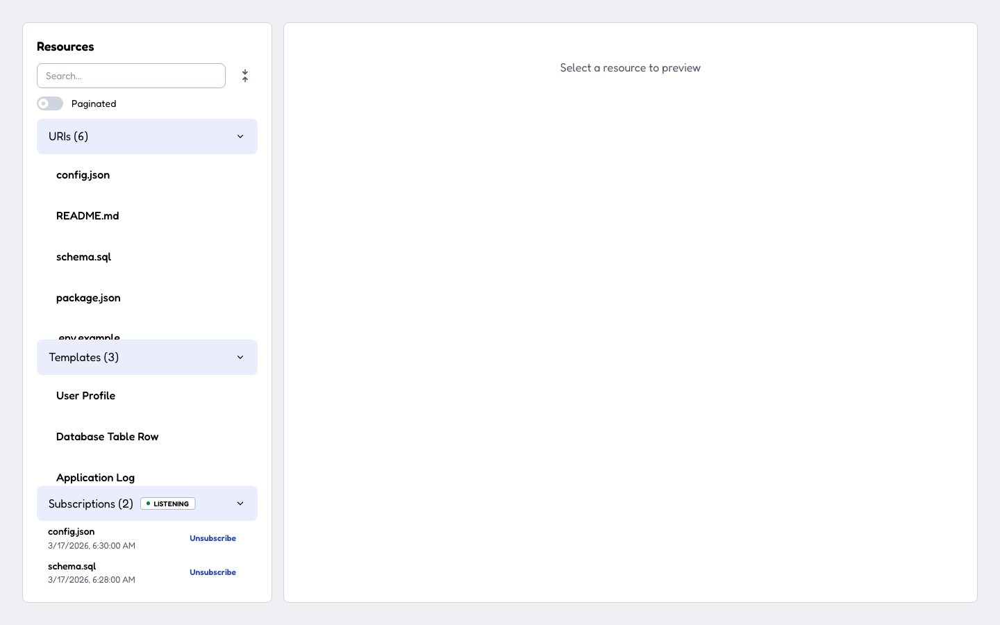
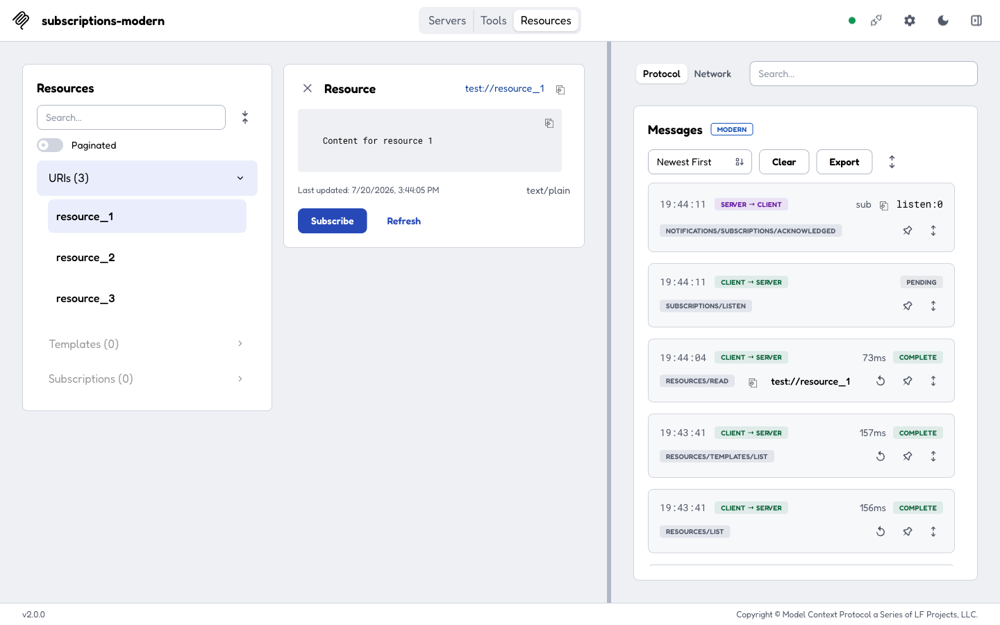
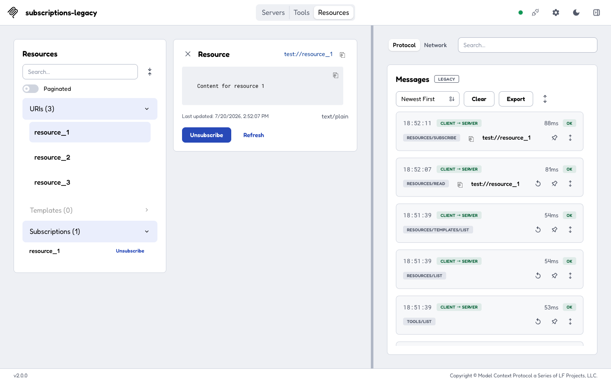
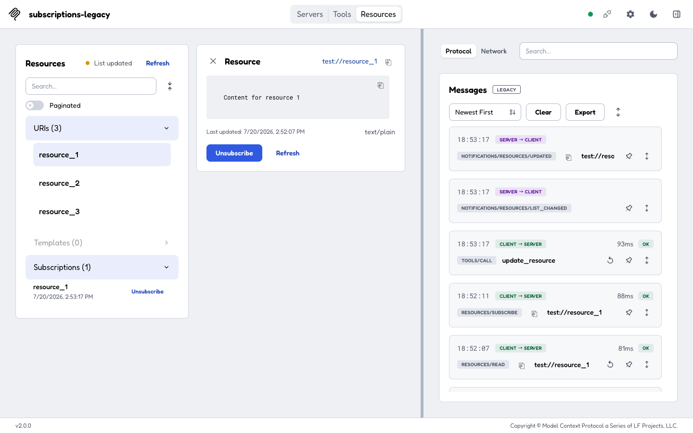

# Resource subscriptions era fork (#1630) — proof screenshots

End-to-end verification of the era fork against two real test servers
(`test-servers/configs/subscriptions-modern-http.json` on port 3220 and
`subscriptions-legacy-http.json` on 3221), driven in a real browser.

## Modern era (2026-07-28)

**`subscriptions-modern-header-badge.png`** — on the modern era the Subscriptions
section shows a single **stream-status badge in its accordion header** (next to the
count, so it stays visible while the section is collapsed): `● Listening` when the
`subscriptions/listen` stream is acknowledged, `● Reconnecting…` while it re-lists
after a drop, `● Stream ended` on graceful close — each explained in a tooltip.
Legacy connections show no badge.

**`subscriptions-modern-listen-acknowledged.png`** — subscribing on a
**Modern**-negotiated connection sends **`subscriptions/listen`** (long-lived →
`PENDING`) and the server answers with **`notifications/subscriptions/acknowledged`**.
No `resources/subscribe` is sent — the defining era-fork behavior. Two other
details: the connection era is shown once in the panel header (`Messages · MODERN`),
not per entry; and the `sub ⧉ listen:0` subscription-id tag rides the notification's
top line (beside the direction) so the method badge below gets the full column width
instead of truncating against the pin control.

## Legacy era (contrast)

**`subscriptions-legacy-resources-subscribe.png`** — the same subscribe on a
**Legacy** connection sends **`resources/subscribe`** (Protocol view, LEGACY) and the
Subscriptions section shows **no stream badge and no header dot** (there is no
persistent stream on the legacy era). Legacy behavior is unchanged.

**`subscriptions-legacy-live-update.png`** — calling the `update_resource` tool emits
**`notifications/resources/updated`** (server → client, Protocol view), and the
subscribed `resource_1` tile stamps its **last-updated time** (`2:53:17 PM`) — the
full subscribe → update → notify round-trip on the legacy era.

## Notes

- The modern subscribe/badge is timing-sensitive **in the browser** because the
  long-lived `subscriptions/listen` SSE stream is proxied through the web backend
  and churns (drops/reconnects ~every 60s), so the badge oscillates between
  `Listening` and `Reconnecting…`. The client-side era-fork logic itself is proven
  deterministically by the integration suite over a direct (Node) transport.
- A tool-triggered `resources/updated` does **not** reach the modern
  `subscriptions/listen` stream on the SDK's stateless modern leg (a tool call and
  the listen stream are separate connections; `server.notification()` rides the
  tool call's connection). This is an SDK server-side gap — the same class as the
  logging showcase's stateless-notification caveat — independent of this PR's
  client-side work. Hence the live-update proof is shown on the legacy era, where
  the round-trip completes.
