# TUI enum forms honor `enumNames` (#1691) — proof screenshots

The TUI tool-test form (`schemaToForm` → `ink-form`) rendered against a legacy
titled enum: `enum: [pet-1 … pet-5]` paired with the non-standard
`enumNames: [Cats … Reptiles]`, `default: "pet-1"`. Captured non-interactively
(a standalone render of the real `ink-form` built by the real `schemaToForm`;
the Ink TUI can't take live keystrokes in a headless pty).

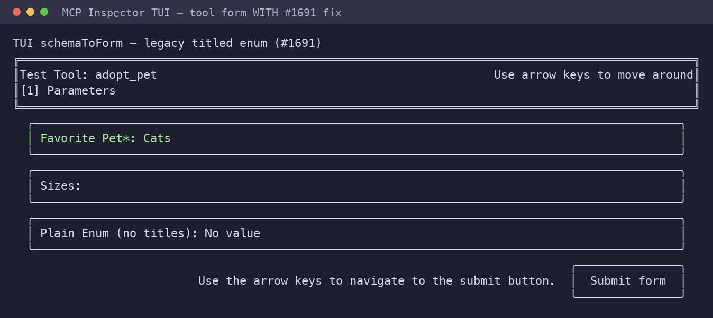

**With the fix:** the required **Favorite Pet** field resolves the default
`pet-1` to its human title **"Cats"**. The submitted value stays the raw
`pet-1` — only the display label changes. (`Plain Enum`, which has no
`enumNames`, is unaffected.)

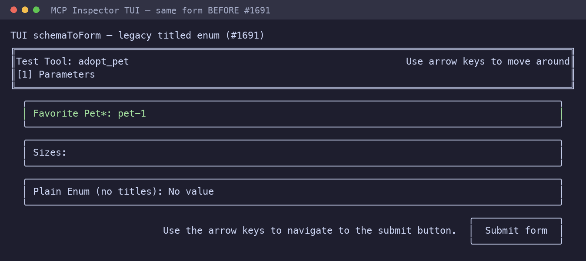

**Before the fix** (same schema with `enumNames` stripped, reproducing the old
behavior): the field shows the opaque wire value **"pet-1"** with no indication
it means "Cats".

Ground-truth options from the real `schemaToForm` confirm the label↔value
pairing and the length-guarded fallbacks: `pet` → `Cats=>pet-1 … Reptiles=>pet-5`;
array-of-enum `sizes` → `Small=>s | Medium=>m | Large=>l`; a mismatched-length
`enumNames` (2 names, 3 values) falls back to raw `a=>a | b=>b | c=>c`. The web
side of this fix is covered by `SchemaForm.test.tsx`.

---

# Server Settings OAuth field disambiguation under EMA (#1692) — proof screenshots

The **Server Settings → OAuth Settings** fields, rendered from the
`ServerSettingsForm` Storybook stories. Under enterprise-managed authorization
(EMA) these fields hold the *resource authorization server* credentials (leg 3 —
its registered client), **not** the app/IdP pair configured in Client Settings.
The unqualified labels sat directly under a toggle naming the enterprise IdP,
making it easy to paste the wrong pair. See #1692.

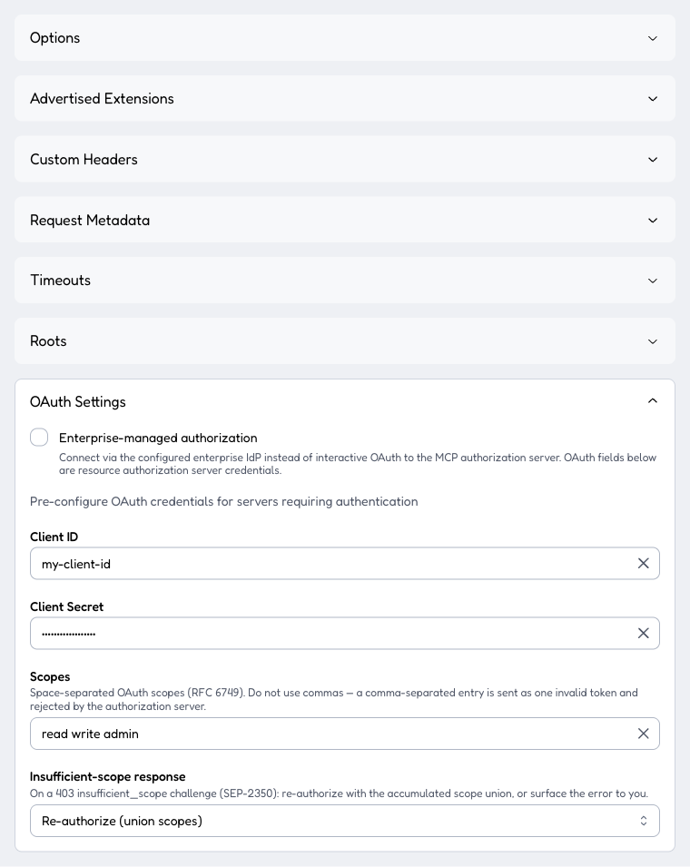

Enterprise-managed authorization **off** (the common case): the fields keep the
plain **Client ID** / **Client Secret** labels. The **Scopes** field now
documents its delimiter — _"Space-separated OAuth scopes (RFC 6749). Do not use
commas — a comma-separated entry is sent as one invalid token and rejected by
the authorization server."_ — with a `mcp tools:read env:read` placeholder.

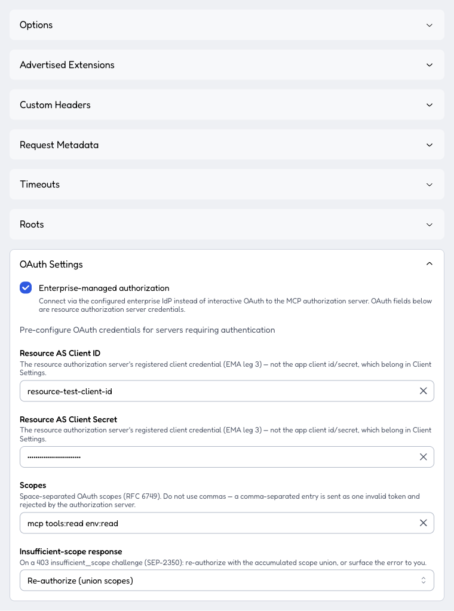

Enterprise-managed authorization **on**: the same two fields relabel to
**Resource AS Client ID** / **Resource AS Client Secret**, each gaining a
description that names the resource authorization server (its registered client,
EMA leg 3) and points the app client id/secret back to Client Settings.

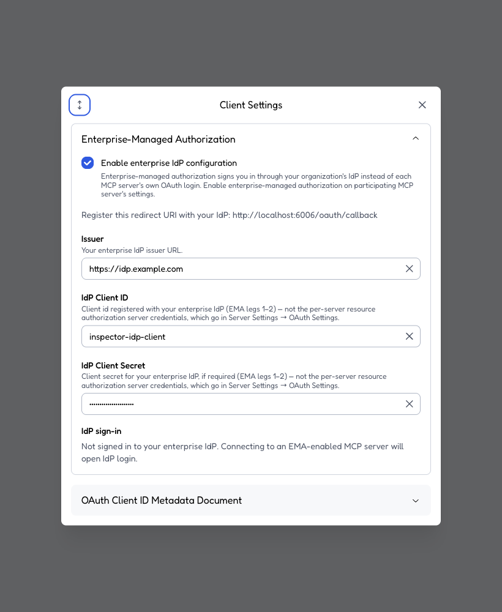

The reciprocal side in the **Client Settings** modal (Enterprise-Managed
Authorization section). Its credential fields are relabeled **IdP Client ID** /
**IdP Client Secret** — parallel to Server Settings' `Resource AS …` — and each
description now points the *other* way: these are the enterprise IdP pair (EMA
legs 1–2), **not** the per-server resource authorization server credentials,
which go in Server Settings → OAuth Settings. Together the two modals close the
loop: each names its pair and where the other lives.

---

# Connection Info extensions + `io.modelcontextprotocol/ui` (#1740) — proof screenshots

End-to-end verification of the Phase 3 Connection Info UI against the legacy
`advertised-extensions-http.json` test server (port 3220), driven in a real
browser through the web client's remote-proxy transport.

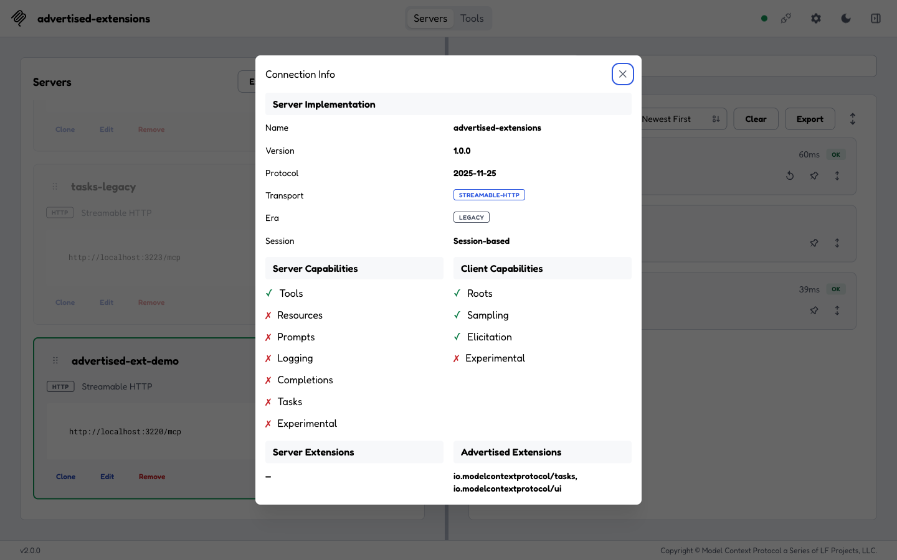

The Connection Info modal on a **legacy** connection (Era: **LEGACY**, no
Discovery section). The new **Server Extensions / Advertised Extensions**
two-column section renders — proving it is era-transparent (before #1740,
extensions only appeared in the modern-only Discovery section). **Advertised
Extensions** shows `io.modelcontextprotocol/tasks, io.modelcontextprotocol/ui`,
confirming the Inspector now advertises the MCP Apps `ui` extension. (Server
Extensions is `—` because this test server advertises none server-side.)

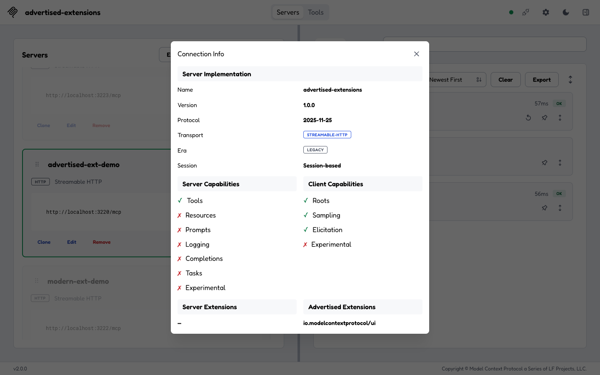

After unchecking **Tasks** in Server Settings → Advertised Extensions (Phase 2)
and reconnecting, the **Advertised Extensions** column shows only
`io.modelcontextprotocol/ui` — the display reflects the per-server override live,
and the `ui` advertisement persists (it is a separate registry entry).

> Note: the Connection Info modal is populated from the connection's
> `initializeResult`, which requires `serverInfo`. On the modern test server used
> here `serverInfo` wasn't populated, so the modal stays closed on that modern
> connection — a pre-existing connection-layer behavior, independent of this PR
> (which only changes content *inside* the modal). The era-transparent
> **Server Extensions** path is covered by unit tests
> (`ConnectionInfoContent.test.tsx` renders legacy server extensions with no
> `discoverResult`).

---

# Advertised-extensions toggle (#1739) — proof screenshots

End-to-end verification of the advertised-extensions debugging knob against a
real legacy HTTP test server (`test-servers/configs/advertised-extensions-http.json`
on port 3220), driven in a real browser through the web client's remote-proxy
transport. The server registers `echo` (always) and `get_weather` **gated on the
`io.modelcontextprotocol/tasks` extension** (`extensionGatedTools`): the tool is
enabled on `notifications/initialized` only when the connected client declared
that extension.

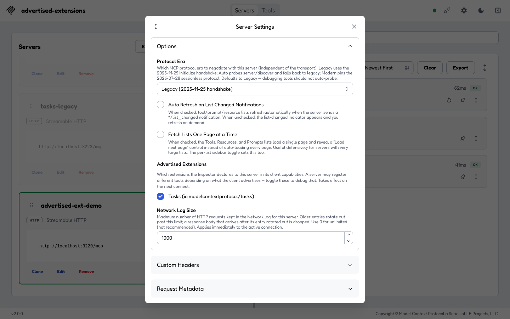

**Server Settings → Advertised Extensions** (the new section). With no override,
**Tasks (io.modelcontextprotocol/tasks)** is checked — the registry default —
so the Inspector advertises it in its client capabilities.

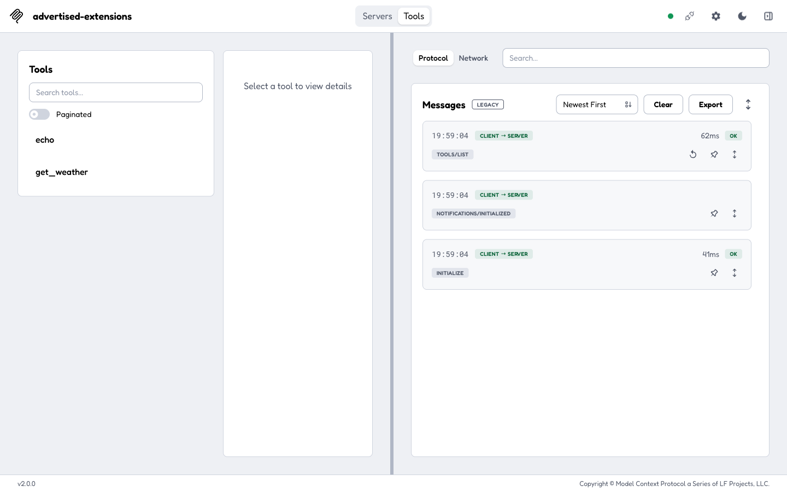

Connected with Tasks advertised. The server sees the declared extension on
`initialized` and enables the gated tool, so `tools/list` returns **both `echo`
and `get_weather`**.

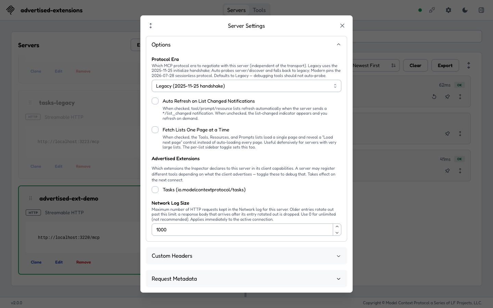

Unchecking **Tasks** writes the per-server `advertisedExtensions` override. The
change takes effect on the next connect (as the section note says).

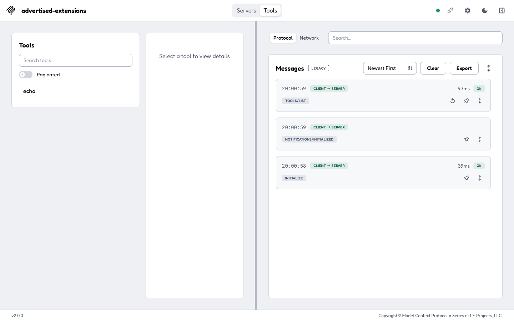

After reconnecting, the client advertises no extensions, so the server never
enables the gated tool — `tools/list` now returns **only `echo`**. The server's
tool registration demonstrably changed based on what the client advertised,
exactly the acceptance criterion for #1739.

---

# x-mcp-header Tools tooling (#1632) — proof screenshots

End-to-end verification of the SEP-2243 `x-mcp-header` Tools tooling against a
real modern (2026-07-28) HTTP test server
(`test-servers/configs/xmcpheader-modern-http.json` on port 3120), driven in a
real browser through the web client's remote-proxy transport.

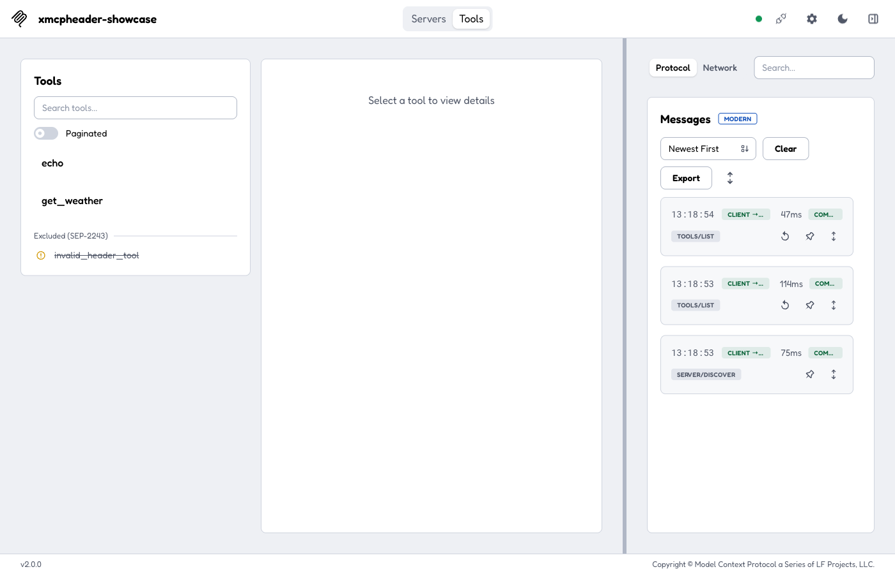

Connected with **Protocol Era = Modern**. `invalid_header_tool` is dropped from
`tools/list` by the SDK (its `x-mcp-header` annotation is invalid), so the
Inspector re-lists the raw list and surfaces it struck-through under an
**"Excluded (SEP-2243)"** divider — showing _why_ a tool vanished rather than
silently omitting it.

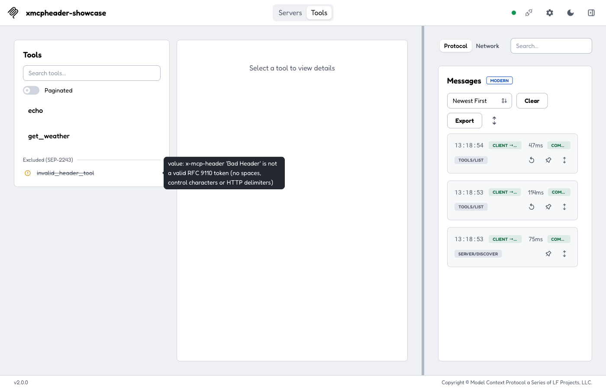

Hovering the excluded tool shows the exact scan reason: the header name
`"Bad Header"` contains a space, so it is not a valid RFC 9110 token.

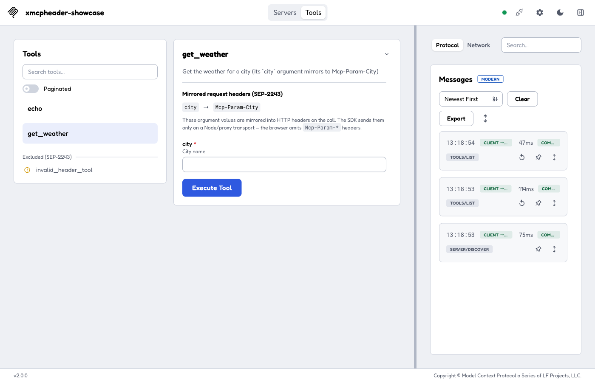

`get_weather`'s detail panel shows the **"Mirrored request headers (SEP-2243)"**
section: its `city` argument mirrors to `Mcp-Param-City`, with the note that the
SDK omits `Mcp-Param-*` on the browser transport.

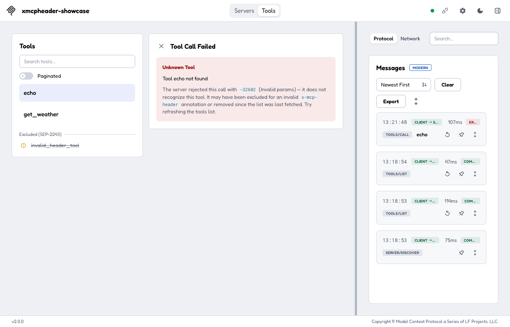

Calling a tool the server no longer recognizes rejects with **`-32602`** (SDK v2)
instead of an `isError` result, and renders as an **"Unknown Tool"** error panel
with a targeted hint (reproduced by swapping the sessionless server to one
without `echo` while the cached list still showed it).

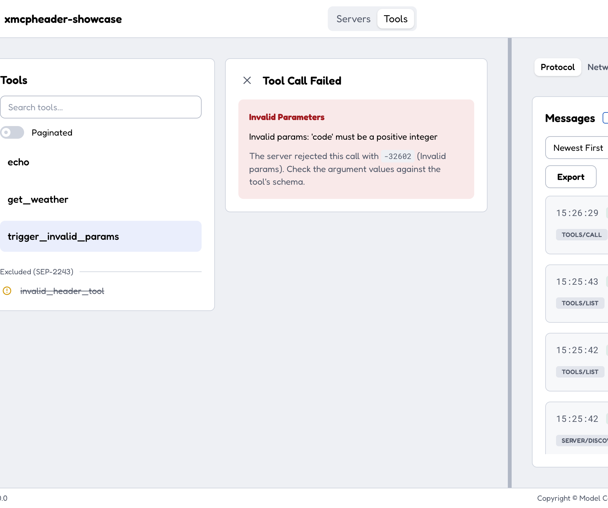

`-32602` is the generic _Invalid params_ code, so a **known** tool rejected for
bad arguments throws the same code as an unknown tool. The panel disambiguates
from the message: a `-32602` that does not name an unknown tool renders under
**"Invalid Parameters"** (with a schema hint) rather than "Unknown Tool".
Triggered live via the `trigger_invalid_params` tool, which returns a real
`-32602` JSON-RPC error whose message is not about a missing tool.

---

# Tasks extension era fork (#1631) — proof screenshots

End-to-end verification of the Tasks era fork against two real test servers
(`test-servers/configs/tasks-modern-http.json` on port 3222 and
`tasks-legacy-http.json` on 3223), driven in a real browser through the web
client's remote-proxy transport.

## Modern era (2026-07-28, `io.modelcontextprotocol/tasks` extension)

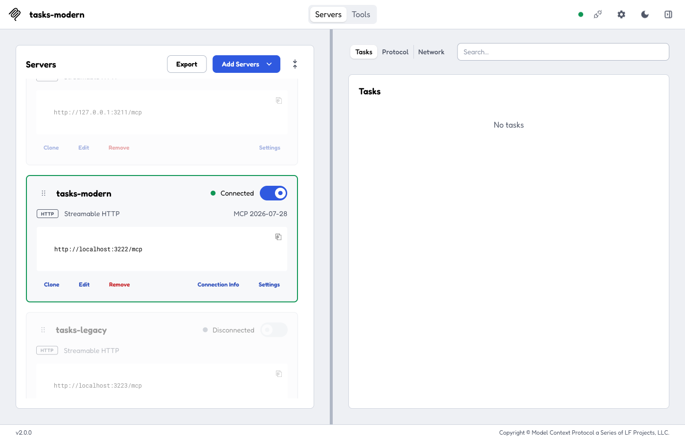

Connected with **Protocol Era = Modern** (`MCP 2026-07-28`). The **Tasks** tab
appears in the monitoring sidebar because the `io.modelcontextprotocol/tasks`
extension was negotiated (it is empty until a task runs).

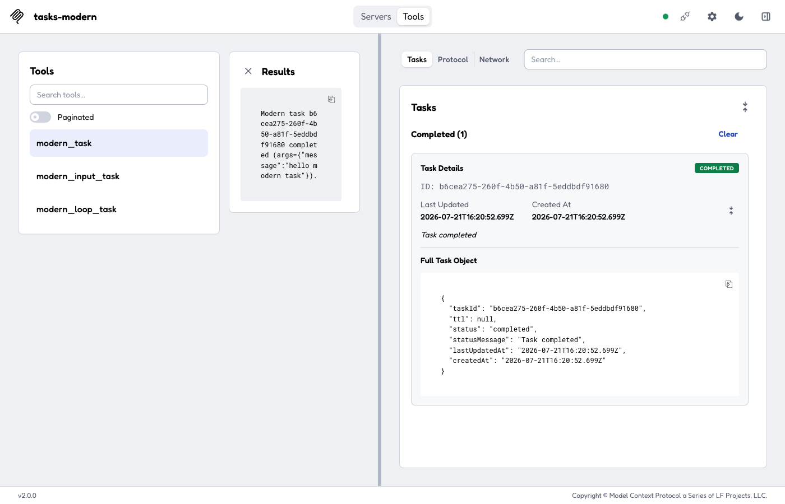

Connected with **Protocol Era = Modern** (`MCP 2026-07-28`). The **Tasks** tab is
gated on the negotiated `io.modelcontextprotocol/tasks` extension (not
`capabilities.tasks`). Running `modern_task` with **Run as task** on issues a
`tools/call` that returns a `CreateTaskResult` (`resultType: "task"`), then polls
**`tasks/get`** (no `tasks/list`); the completed task **inlines its result** (no
blocking `tasks/result`) — shown both in the Results panel and the Tasks card.

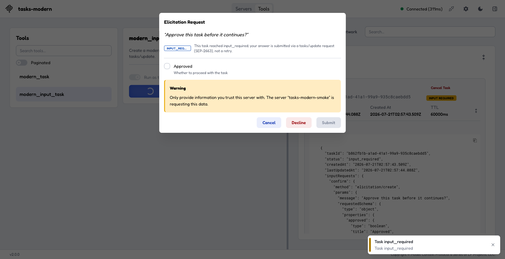

`modern_input_task` moves to **`input_required`**: the `tasks/get` response's
`inputRequests` map (visible in the task's Full Task Object) carries an embedded
`elicitation/create`, surfaced through the same pending-request modal the MRTR
path uses — note the accurate wording _"your answer is submitted via a
tasks/update request (SEP-2663), not a retry"_. Answering it sends
**`tasks/update`** with the `inputResponses`, and the next poll completes the
task:

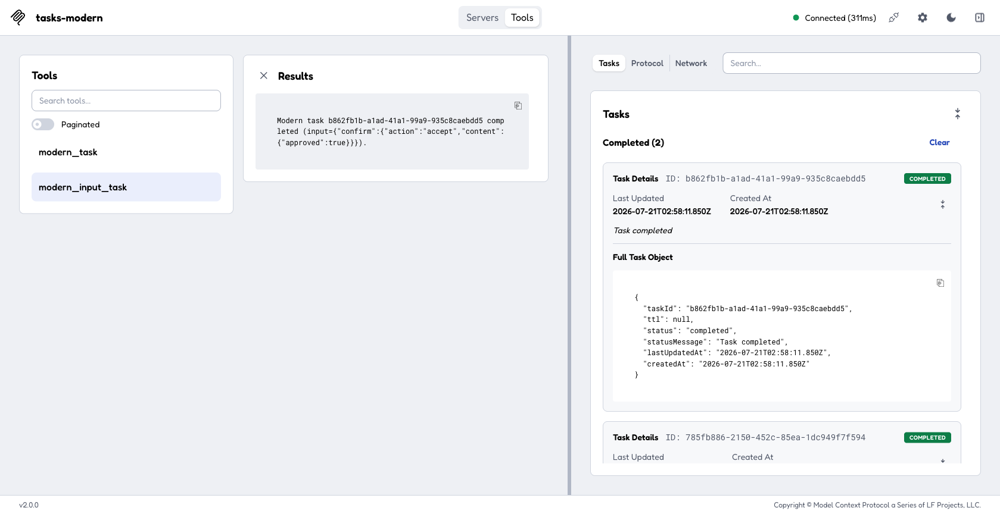

## Legacy era (2025-11-25, contrast — unchanged)

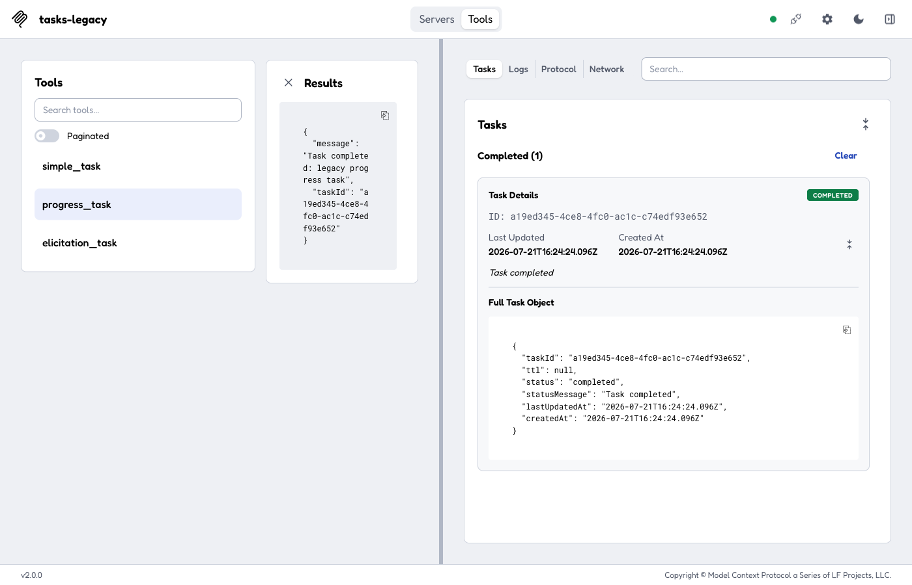

Connected with **Protocol Era = Legacy**. The Tasks tab is gated on
`capabilities.tasks`; `simple_task` is `taskSupport: "required"` so **Run as
task** is forced on. The legacy flow uses `tasks/list` to populate the list,
`tasks/get` to poll, and the blocking **`tasks/result`** to fetch the payload
(`{ "message": "Task completed: no message", "taskId": … }`). Note the legacy-only
**Logs** tab (this server advertises `logging`), absent from the modern monitor
set.

## Notes

- SDK v2 removed all tasks support **and** era-gates the `tasks/*` spec methods
  out of the 2026-07-28 era on **both** the client (outbound) and server
  (inbound), and its codec rejects a `resultType: "task"` result outright. So the
  Inspector drives the extension itself: the task-creation frame is rewritten at
  the transport into a `CallToolResult` carrying the handle (the true
  `resultType: "task"` frame is still logged to the Protocol/Network tabs), and
  `tasks/get` / `tasks/update` / `tasks/cancel` ride a raw-wire request channel
  that carries the full modern envelope and is consumed by the transport before
  the SDK Client sees it. The test server serves `tasks/*` from an Express
  interceptor ahead of the SDK handler (the SDK's modern leg would answer them
  `-32601`).
- On modern, task creation is **server-directed** (SEP-2663): the client declares
  the extension once and any tool may return a task, so the Tools screen offers
  **Run as task** for every tool on a modern connection (rather than gating on the
  legacy per-tool `taskSupport`).
